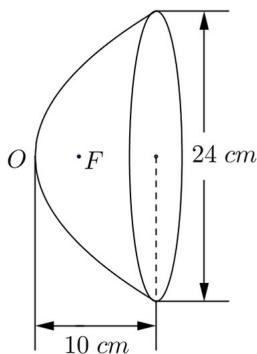

<!-- question-source:start -->
27. 如图, 汽车前灯反射镜与轴截面的交线是抛物线的一部分, 灯口所在的圆面与反射镜的轴垂直, 灯泡位于抛物线的焦点 $F$ 处, 已知灯口直径是 $24 \mathrm{~cm}$ , 灯深 $10 \mathrm{~cm}$ , 求灯泡与反射镜的顶点 $O$ 的距离;

<!-- question-source:end -->

![[高中/真题/按年份分类/2016/2016年上海高三数学春考试卷_含答案_/解答题/题目/answers/Q00023942A1.md]]
