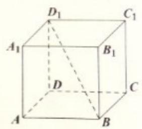

<!-- question-source:start -->
6. 如图, 在正四棱柱 $ABCD - A_1B_1C_1D_1$ 中, 底面 $ABCD$ 的边长为 3, $BD_1$ 与底面所成的角的

大小为 $\arctan \frac{2}{3}$ ，则该正四棱柱的高等于 \_\_\_\_.

<!-- question-source:end -->

![[高中/真题/按年份分类/2016/2016年上海高考数学真题_理科_试卷_word解析版_/填空题/题目/answers/Q00022074A1.md]]
