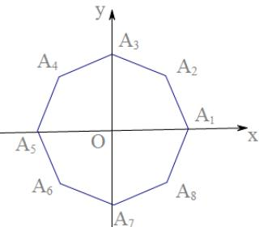

<!-- question-source:start -->
15. 两点 $A_{i}, A_{j}$ ，点 $P$ 满足 $\overrightarrow{OP} + \overrightarrow{OA_{i}} + \overrightarrow{OA_{j}} = \overrightarrow{0}$ ，则点 $P$ 落在第一象限的概率是 \_\_\_\_.

<!-- question-source:end -->

![[高中/真题/按年份分类/2016/2016年上海高考数学真题_理科_试卷_word解析版_/填空题/题目/answers/Q00022083A1.md]]
