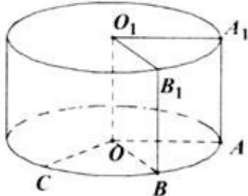

<!-- question-source:start -->
19. (本题满分 12 分) 本题共有 2 个小题, 第一小题满分 6 分, 第二小题满分 6 分. 将边长为 1 的正方形 $AA_{1}O_{1}O$ (及其内部) 绕的 $OO_{1}$ 旋转一周形成圆柱, 如图, $\overline{A}_{C}$ 长为 $\frac{2}{3}\pi$ , $\overline{A}_{1}B_{1}$ 长为 $\frac{\pi}{3}$ , 其中 $B_{1}$ 与 $C$ 在平面 $AA_{1}O_{1}O$ 的同侧.

(1) 求三棱锥 $C - O_{1}A_{1}B_{1}$ 的体积；

(2) 求异面直线 $B_{1}C$ 与 $AA_{1}$ 所成的角的大小.

<!-- question-source:end -->

![[高中/真题/按年份分类/2016/2016年上海高考数学真题_理科_试卷_word解析版_/解答题/题目/answers/Q00022087A1.md]]
