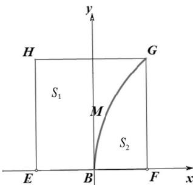

<!-- question-source:start -->
20. （本题满分 14）本题共有 2 个小题，第 1 小题满分 6 分，第 2 小题满分 8 分.

有一块正方形菜地 EFGH, EH 所在直线是一条小河. 收获的蔬菜可送到 F 点或河边运走.

于是，菜地分为两个区域 $S_{1}$ 和 $S_{2}$ ，其中 $S_{1}$ 中的蔬菜运到河边较近， $S_{2}$ 中的蔬菜运到 F 点较

近，而菜地内 $S_{1}$ 和 $S_{2}$ 的分界线 C 上的点到河边与到 F 点的距离相等，现建立平面直角坐标系，其中原点 O 为 EF 的中点，点 F 的坐标为 $(1,0)$ ，如图.

(1) 求菜地内的分界线 C 的方程;

(2) 菜农从蔬菜运量估计出 $S_{1}$ 面积是 $S_{2}$ 面积的两倍，由此得到 $S_{1}$ 面积的“经验值”为 $\frac{8}{3}$ . 设 $M$ 是 $C$ 上纵坐标为 1 的点，请计算以 $EH$ 为一边、另有一边过点 $M$ 的矩形的面积，及五边形 $EOMGH$ 的面积，并判断哪一个更接近于 $S_{1}$ 面积的经验值.
<!-- question-source:end -->

![[高中/真题/按年份分类/2016/2016年上海高考数学真题_理科_试卷_word解析版_/解答题/题目/answers/Q00022088A1.md]]
