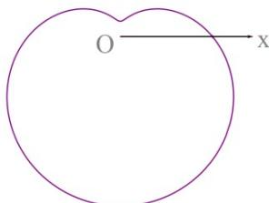

<!-- question-source:start -->
16.下列极坐标方程中，对应的曲线为如图的是（）.

(A) $\rho = 6 + 5\cos \theta$ (B) $\rho = 6 + 5\sin \theta$ (C) $\rho = 6 - 5\cos \theta$ (D) $\rho = 6 - 5\sin \theta$
<!-- question-source:end -->

![[高中/真题/按年份分类/2016/2016年上海高考数学真题_理科_试卷_word解析版_/选择题/题目/answers/Q00022084A1.md]]
