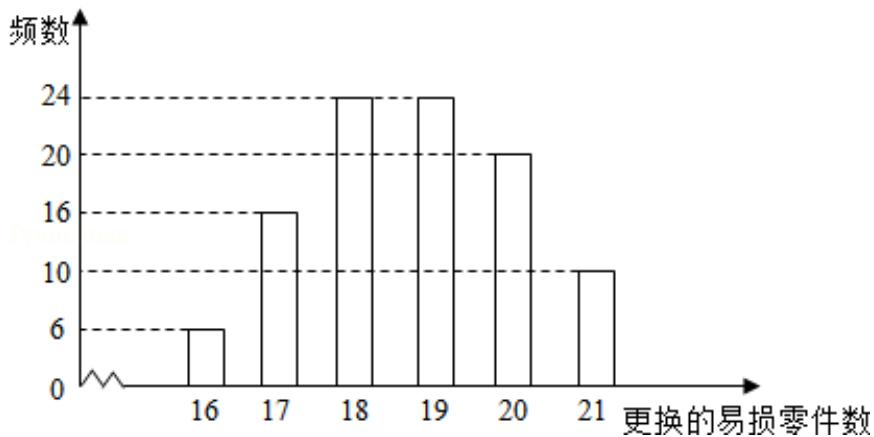

<!-- question-source:start -->
19. (12 分) 某公司计划购买 1 台机器, 该种机器使用三年后即被淘汰. 机器有一
易损零件, 在购进机器时, 可以额外购买这种零件作为备件, 每个 200 元. 在机
器使用期间, 如果备件不足再购买, 则每个 500 元. 现需决策在购买机器时应
同时购买几个易损零件, 为此搜集并整理了 100 台这种机器在三年使用期内
更换的易损零件数, 得如图柱状图:

记 x 表示 1 台机器在三年使用期内需更换的易损零件数，y 表示 1 台机器在购买
易损零件上所需的费用（单位：元），n 表示购机的同时购买的易损零件数.

（Ⅰ）若 n=19，求 y 与 x 的函数
<!-- question-source:end -->

![[高中/真题/按年份分类/2016/2016年全国统一高考数学试卷_文科__新课标ⅰ__含解析版_/解答题/题目/answers/Q00024813A1.md]]
