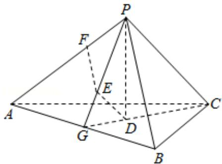

> [!faq]- 2016年全国统一高考数学试卷（文科）（新课标ⅰ）（含解析版）解析
>
> > [!success]- **【答案】** . 【
>
> > [!note]- **【分析】**
> > （Ⅰ）根据题意
>
> > [!note]- **【解析】**
> > 分析】（Ⅰ）根据题意
> > 分析可得 PD⊥平面 ABC，进而可得 PD⊥AB，同理可得
> >
> > DE⊥AB，结合两者
> > 分析可得 AB⊥平面 PDE，进而
> > 分析可得 AB⊥PG，又由
> >
> > PA=PB，由等腰三角形的性质可得证明；
> >
> > （Ⅱ）由线面垂直的判定方法可得 $EF \perp$ 平面PAC，可得 $F$ 为 $E$ 在平面PAC内的正投
> >
> > 影．由棱锥的体积公式计算可得
> > 答案.
> >
> > 【
> > 解答】解：（Ⅰ）证明：∵P-ABC为正三棱锥，且D为顶点P在平面ABC内的正投
> >
> > 影，
> >
> > ∴PD⊥平面 ABC，则 PD⊥AB，
> >
> > 又 E 为 D 在平面 PAB 内的正投影，
> >
> > ∴DE⊥面 PAB，则 DE⊥AB，
> >
> > ∵PD∩DE=D,
> >
> > ∴AB⊥平面 PDE，连接 PE 并延长交 AB 于点 G，
> >
> > 则 AB⊥PG，
> >
> > 又 PA=PB，
> >
> > ∴G 是 AB 的中点;
> >
> > （II）在平面 PAB 内，过点 E 作 PB 的平行线交 PA 于点 F，F 即为 E 在平面 PAC 内的
> >
> > 正投影.
> >
> > ∵正三棱锥 P - ABC 的侧面是直角三角形，
> >
> > ∴PB⊥PA，PB⊥PC，
> >
> > 又 EF∥PB，所以 EF⊥PA，EF⊥PC，因此 EF⊥平面 PAC，
> >
> > 即点 F 为 E 在平面 PAC 内的正投影.
> >
> > 连结 CG，因为 P 在平面 ABC 内的正投影为 D，所以 D 是正三角形 ABC 的中心.
> >
> > 由（Ⅰ）知，G 是 AB 的中点，所以 D 在 CG 上，故 $CD=\frac{2}{3}CG$ .
> >
> > 由题设可得 PC⊥平面 PAB，DE⊥平面 PAB，所以 DE∥PC，因此 PE= $\frac{2}{3}$ PG，DE= $\frac{1}{3}$ PC.
> >
> > 由已知，正三棱锥的侧面是直角三角形且 PA=6，可得 DE=2，PG=3 $\sqrt{2}$ ，PE=2 $\sqrt{2}$ .
> >
> > 在等腰直角三角形 EFP 中，可得 EF=PF=2.
> >
> > 所以四面体 PDEF 的体积 $V=\frac{1}{3}\times DE \times S_{\triangle PEF}=\frac{1}{3}\times2\times\frac{1}{2}\times2\times2=\frac{4}{3}$ .
> >
> > 
> >
> > 【点评】本题考查几何体的体积计算以及线面垂直的性质、应用, 解题的关键是正
> > 确
> > 分析几何体的各种位置、距离关系.
