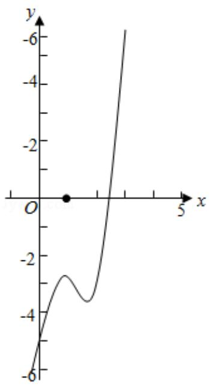
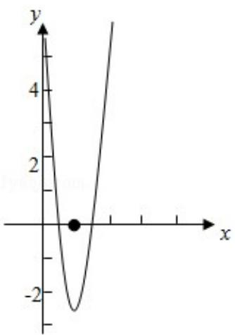

> [!faq]- 2016年全国统一高考数学试卷（文科）（新课标ⅰ）（含解析版）解析
>
> > [!success]- **【答案】** 详见解析
>
> > [!note]- **【分析】**
> > 法; 51: 函数的性质及应用; 53: 导数的综合应用.
>
> > [!note]- **【解析】**
> > 解：（Ⅰ）由 $f(x) = (x - 2)e^{x} + a(x - 1)^{2}$ ,
> >
> > 可得 $f'(x) = (x - 1)e^{x} + 2a(x - 1) = (x - 1)(e^{x} + 2a)$ ，
> >
> > ① 当 $a \geq 0$ 时，由 $f'(x) > 0$ ，可得 x > 1；由 $f'(x) < 0$ ，可得 x < 1，
> >
> > 即有 $f(x)$ 在 $(-∞, 1)$ 递减；在 $(1, +∞)$ 递增（如右上图）；
> >
> > ② 当 $a < 0$ 时，(如右下图) 若 $a = -\frac{e}{2}$ ，则 $f'(x) \geqslant 0$ 恒成立，即有 $f(x)$ 在 $R$ 上递增；
> >
> > 若 $a < -\frac{e}{2}$ 时，由 $f'(x) > 0$ ，可得 $x < 1$ 或 $x > \ln (-2a)$ ；
> >
> > 由 $f'(x) < 0$ ，可得 $1 < x < \ln(-2a)$ 。
> >
> > 即有 $f(x)$ 在 $(-∞, 1)$ ， $(ln(-2a), +∞)$ 递增；
> >
> > 在（1，In（-2a））递减；
> >
> > 若 $-\frac{e}{2} < a < 0$ ，由 $f'(x) > 0$ ，可得 $x < \ln (-2a)$ 或 $x > 1$ ;
> >
> > 由 $f'(x) < 0$ ，可得 $\ln(-2a) < x < 1$ .
> >
> > 即有 $f(x)$ 在 $(-∞, ln(-2a))$ ， $(1, +∞)$ 递增；
> >
> > 在（In（-2a），1）递减；
> >
> > (II) ①由 (I) 可得当 $a > 0$ 时,
> >
> > f (x) 在 $(-∞, 1)$ 递减；在 $(1, +∞)$ 递增，
> >
> > 且 $f(1) = -e < 0, x \to +\infty, f(x) \to +\infty;$
> >
> > 当 $x \to -\infty$ 时 $f(x) > 0$ 或找到一个 $x < 1$ 使得 $f(x) > 0$ 对于 $a > 0$ 恒成立，
> >
> > f (x) 有两个零点;
> >
> > ② 当 a=0 时， $f(x)=(x-2)e^{x}$ ，所以 $f(x)$ 只有一个零点 x=2；
> >
> > ③ 当 a<0 时，
> >
> > 若 $a < -\frac{e}{2}$ 时， $f(x)$ 在 $(1, \ln (-2a))$ 递减，
> >
> > 在 $(-∞, 1)$ ， $(ln(-2a), +∞)$ 递增，
> >
> > 又当 $x \leq 1$ 时， $f(x) < 0$ ，所以 $f(x)$ 不存在两个零点；
> >
> > 当 $a \geq -\frac{e}{2}$ 时，在 $(- \infty, \ln (-2a))$ 单调增，在 $(1, +\infty)$ 单调增，
> >
> > 在（1n（-2a），1）单调减，
> >
> > 只有 f（ln（-2a））等于 0 才有两个零点，
> >
> > 而当 $x \leq 1$ 时， $f(x) < 0$ ，所以只有一个零点不符题意。
> >
> > 综上可得， $f(x)$ 有两个零点时，a 的取值范围为 $(0, +\infty)$ .
> >
> > 
> >
> > 
> >
> > 【点评】本题考查导数的运用：求单调区间，考查函数零点的判断，注意运用分类
> >
> > 讨论的思想方法和函数方程的转化思想，考查化简整理的运算能力，属于难题
> >
> > 请考生在 22、23、24 三题中任选一题作答，如果多做，则按所做的第一题计分.
> >
> > [选修 4-1：几何证明选讲]
