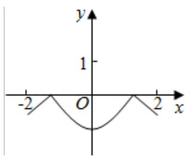
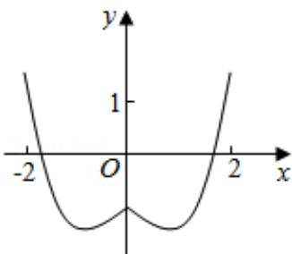
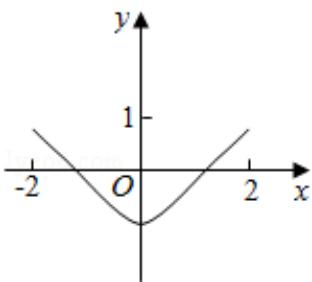
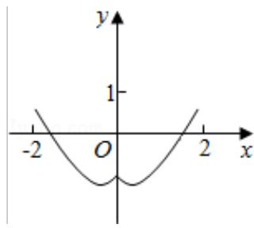

<!-- question-source:start -->
9. (5分) 函数 $y = 2x^{2} - e^{|x|}$ 在[-2, 2]的图象大致为（）

  
A.

B.  

C.

  
D.
<!-- question-source:end -->

![[高中/真题/按年份分类/2016/2016年全国统一高考数学试卷_文科__新课标ⅰ__含解析版_/选择题/题目/answers/Q00024803A1.md]]
