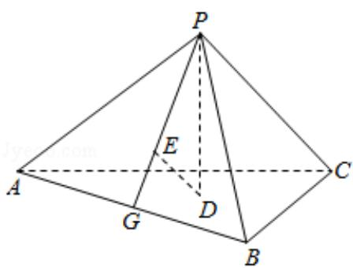

<!-- question-source:start -->
18. (12 分) 如图, 已知正三棱锥 P - ABC 的侧面是直角三角形, PA=6, 顶点 P 在平面 ABC 内的正投影为点 D, D 在平面 PAB 内的正投影为点 E, 连接 PE 并延长交 AB 于点 G.

（Ⅰ）证明：G 是 AB 的中点；

（II）在图中作出点 E 在平面 PAC 内的正投影 F（说明作法及理由），并求四面体 PDEF 的体积.

<!-- question-source:end -->

![[高中/真题/按年份分类/2016/2016年全国统一高考数学试卷_文科__新课标ⅰ__含解析版_/选择题/题目/answers/Q00024812A1.md]]
