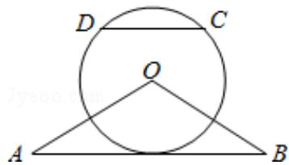

<!-- question-source:start -->
22. (10 分) 如图, $\triangle OAB$ 是等腰三角形, $\angle AOB = 120^{\circ}$ . 以 $O$ 为圆心, $\frac{1}{2} OA$ 为半径

作圆.

（Ⅰ）证明：直线 AB 与 $\odot O$ 相切；

（II）点 C，D 在 $\odot O$ 上，且 A，B，C，D 四点共圆，证明：AB $\parallel$ CD.

## [选修 4-4：坐标系与参数方程]
<!-- question-source:end -->

![[高中/真题/按年份分类/2016/2016年全国统一高考数学试卷_文科__新课标ⅰ__含解析版_/选择题/题目/answers/Q00024816A1.md]]
