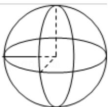

> [!faq]- 2016年全国统一高考数学试卷（文科）（新课标ⅰ）（含解析版）解析
>
> > [!success]- **【答案】** A
>
> > [!note]- **【分析】**
> > 判断三视图复原的几何体的形状, 利用体积求出几何体的半径, 然后求解
> > 几何体的表面积.
>
> > [!note]- **【解析】**
> > 分析】判断三视图复原的几何体的形状, 利用体积求出几何体的半径, 然后求解
> > 几何体的表面积.
> >
> > 【
> > 解答】解：由题意可知三视图复原的几何体是一个球去掉 $\frac{1}{8}$ 后的几何体，如图：可得： $\frac{7}{8} \times \frac{4}{3} \pi R^3 = \frac{28\pi}{3}$ ， $R = 2$ 。
> >
> > 它的表面积是： $\frac{7}{8}\times 4\pi \bullet 2^2 +\frac{3}{4}\times \pi \cdot 2^2 = 17\pi .$
> >
> > 故选：A.
> >
> > 
> >
> > 【点评】本题考查三视图求解几何体的体积与表面积，考查计算能力以及空间想
> >
> > 象能力.
