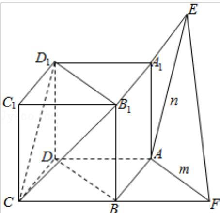

> [!faq]- 2016年全国统一高考数学试卷（文科）（新课标ⅰ）（含解析版）解析
>
> > [!success]- **【答案】** A
>
> > [!note]- **【分析】**
> > 画出图形，判断出 m、n 所成角，求解即可.
>
> > [!note]- **【解析】**
> > 解：如图： $\alpha\|$ 平面 $CB_{1}D_{1}$ ， $\alpha\cap$ 平面ABCD=m， $\alpha\cap$ 平面 $ABA_{1}B_{1}=n$ ，
> >
> > 可知： $n\|CD_{1}$ ， $m\|B_{1}D_{1}$ ，∵ $\triangle CB_{1}D_{1}$ 是正三角形．m、n所成角就是 $\angle CD_{1}B_{1}=60^{\circ}$
> >
> > 则 m、n 所成角的正弦值为： $\frac{\sqrt{3}}{2}$ .
> >
> > 故选：A.
> >
> > 
