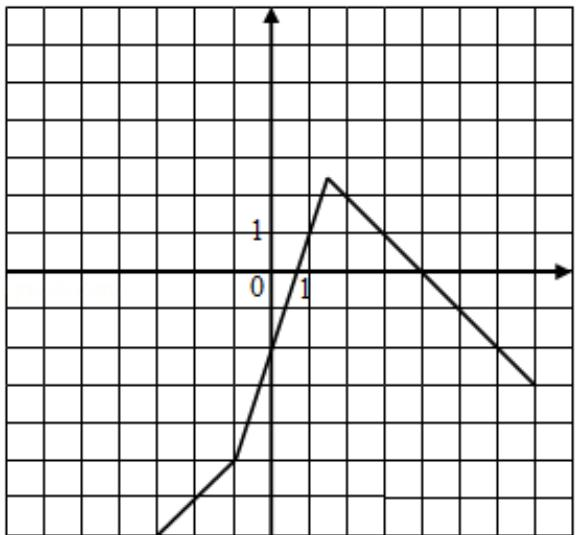

> [!faq]- 2016年全国统一高考数学试卷（文科）（新课标ⅰ）（含解析版）解析
>
> > [!success]- **【答案】** 详见解析
>
> > [!note]- **【分析】**
> > （Ⅰ）运用分段函数的形式写出 $f(x)$ 的解析式，由分段函数的画法，即可
>
> > [!note]- **【解析】**
> > 解：（Ⅰ）f(x) = $\left\{\begin{aligned}&x-4,&x\leqslant-1\\ &3x-2,&-1<x<\frac{3}{2},\\ &4-x,&x\geqslant\frac{3}{2}\end{aligned}\right.$
> >
> > 由分段函数的图象画法，可得 $f(x)$ 的图象，如右：
> >
> > （Ⅱ）由 $|f(x)|>1$ ，可得
> >
> > 当 $x \leq -1$ 时， $|x - 4| > 1$ ，解得 x > 5 或 x < 3，即有 $x \leq -1$ ;
> >
> > 当 $-1 < x < \frac{3}{2}$ 时， $|3x - 2| > 1$ ，解得 $x > 1$ 或 $x < \frac{1}{3}$ ，
> >
> > 即有 $-1 < x < \frac{1}{3}$ 或 $1 < x < \frac{3}{2}$ ;
> >
> > 当 $x \geq \frac{3}{2}$ 时， $|4 - x| > 1$ ，解得 x > 5 或 x < 3，即有 x > 5 或 $\frac{3}{2} \leqslant x < 3$ .
> >
> > 综上可得， $x<\frac{1}{3}$ 或 1<x<3 或 x>5.
> >
> > 则 $|f(x)| > 1$ 的解集为 $(-∞, \frac{1}{3}) ∪ (1, 3) ∪ (5, +∞)$ .
> >
> >   
> > 【点评】本题考查绝对值函数的图象和不等式的解法，注意运用分段函数的图象  
> > 的画法和分类讨论思想方法，考查运算能力，属于基础题.
