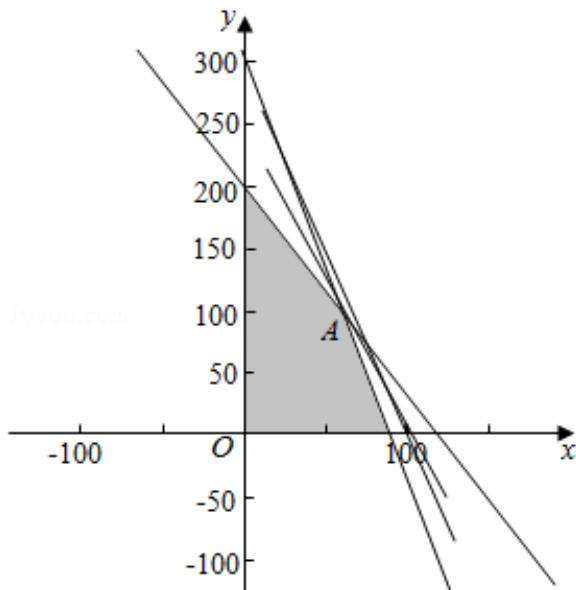

> [!faq]- 2016年全国统一高考数学试卷（文科）（新课标ⅰ）（含解析版）解析
>
> > [!success]- **【答案】** 216000
>
> > [!note]- **【分析】**
> > 设 A、B 两种产品分别是 x 件和 y 件，根据题干的等量关系建立不等式组以
>
> > [!note]- **【解析】**
> > 解：
> > （1）设 A、B 两种产品分别是 x 件和 y 件，获利为 z 元.
> >
> > 由题意，得 $\left\{\begin{aligned}x&\in N,y\in N\\ 1.5x+0.5y&\leqslant150\\ x+0.3y&\leqslant90\\ 5x+3y&\leqslant600\end{aligned}\right.$ ，z=2100x+900y.
> >
> > 不等式组表示的可行域如图：由题意可得 $\left\{ \begin{array}{l} x + 0.3y = 90 \\ 5x + 3y = 600 \end{array} \right.$ ，解得： $\left\{ \begin{array}{l} x = 60 \\ y = 100 \end{array} \right.$ ，A（60，100），
> >
> > 目标函数 $z = 2100x + 900y$ 。经过 A 时，直线的截距最大，目标函数取得最大值：
> >
> > $$
> > 2 1 0 0 \times 6 0 + 9 0 0 \times 1 0 0 = 2 1 6 0 0 0 \text {   元   }
> > $$
> >
> > 故答案为：216000.
> >
> > 
