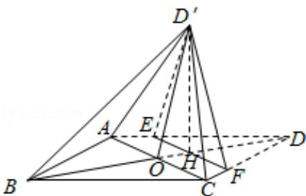

<!-- question-source:start -->
19. (12 分) 如图, 菱形 ABCD 的对角线 AC 与 BD 交于点 O, 点 E、F 分别在 AD, CD

上，AE=CF，EF交BD于点H，将△DEF沿EF折到△D'EF的位置.

（Ⅰ）证明：AC⊥HD';

（II）若 AB=5，AC=6， $AE=\frac{5}{4}$ ， $OD'=2\sqrt{2}$ ，求五棱锥 $D'-ABCFE$ 体积.

<!-- question-source:end -->

![[高中/真题/按年份分类/2016/2016年全国统一高考数学试卷_文科__新课标ⅱ__含解析版_/解答题/题目/answers/Q00024953A1.md]]
