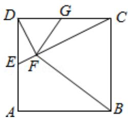

<!-- question-source:start -->
22.（10分）如图，在正方形ABCD中，E，G分别在边DA，DC上（不与端点重合），

且 DE=DG，过 D 点作 DF⊥CE，垂足为 F.

（Ⅰ）证明：B，C，G，F四点共圆；

(II) 若 AB=1，E 为 DA 的中点，求四边形 BCGF 的面积.

## [选项 4-4：坐标系与参数方程]
<!-- question-source:end -->

![[高中/真题/按年份分类/2016/2016年全国统一高考数学试卷_文科__新课标ⅱ__含解析版_/解答题/题目/answers/Q00024956A1.md]]
