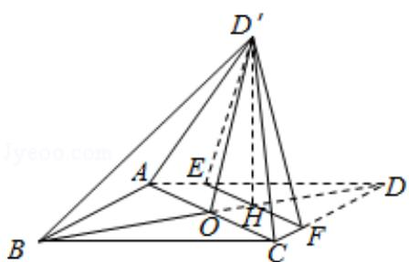

> [!faq]- 2016年全国统一高考数学试卷（文科）（新课标ⅱ）（含解析版）解析
>
> > [!success]- **【答案】** 详见解析
>
> > [!note]- **【分析】**
> > （1）根据直线平行的性质以菱形对角线垂直的性质进行证明即可.
> > (2) 根据条件求出底面五边形的面积, 结合平行线段的性质证明 $\mathrm{OD}^{\prime}$ 是五棱锥 $\mathrm{D}^{\prime}$
>
> > [!note]- **【解析】**
> > （Ⅰ）证明：∵菱形 ABCD 的对角线 AC 与 BD 交于点 O，点 E、F 分别在
> >
> > AD, CD 上, AE=CF,
> >
> > ∴EF∥AC，且 EF⊥BD
> >
> > 将△DEF 沿 EF 折到△D'EF 的位置，
> >
> > 则 D'H⊥EF，
> >
> > ∵EF∥AC,
> >
> > $\therefore AC \perp HD'$ ;
> >
> > （II）若 AB=5，AC=6，则 AO=3，B0=OD=4，
> >
> > $$
> > \because A E = \frac {5}{4}, A D = A B = 5,
> > $$
> >
> > $$
> > \therefore D E = 5 - \frac {5}{4} = \frac {1 5}{4},
> > $$
> >
> > ∵EF∥AC,
> >
> > $$
> > \therefore \frac {\mathrm{DE}}{\mathrm{AD}} = \frac {\mathrm{EH}}{\mathrm{AO}} = \frac {\mathrm{DH}}{\mathrm{OD}} = \frac {\frac {1 5}{4}}{\frac {4}{5}} = \frac {3}{4},
> > $$
> >
> > $$
> > \therefore E H = \frac {9}{4}, E F = 2 E H = \frac {9}{2}, D H = 3, O H = 4 - 3 = 1,
> > $$
> >
> > $$
> > \because H D ^ {\prime} = D H = 3, O D ^ {\prime} = 2 \sqrt {2},
> > $$
> >
> > ∴满足 $HD'^{2}=OD'^{2}+OH^{2}$ ,
> >
> > 则 $\triangle OHD'$ 为直角三角形，且 $OD'\perp OH$ ，
> >
> > 又 $OD'\perp AC$ ，AC∩OH=O，
> >
> > 即 $OD' \perp$ 底面 ABCD，
> >
> > 即 OD' 是五棱锥 D' - ABCFE 的高.
> >
> > 底面五边形的面积 $S = \frac{1}{2} \times AC \cdot OB + \frac{(EF + AC) \cdot OH}{2} = \frac{1}{2} \times 6 \times 4 + \frac{\left(\frac{9}{2} + 6\right) \times 1}{2} = 12 + \frac{21}{4} = \frac{69}{4}$
> >
> > 则五棱锥 $D'$ - ABCFE 体积 $V=\frac{1}{3}S\bullet OD'=\frac{1}{3}\times\frac{69}{4}\times2\sqrt{2}=\frac{23\sqrt{2}}{2}$ .
> >
> > 
> >
> > 【点评】本题主要考查空间直线和平面的位置关系的判断，以及空间几何体的体
> >
> > 积, 根据线面垂直的判定定理以及五棱锥的体积公式是解决本题的关键. 本题
> >
> > 的难点在于证明 $OD'$ 是五棱锥 $D' - ABCFE$ 的高．考查学生的运算和推理能力．
