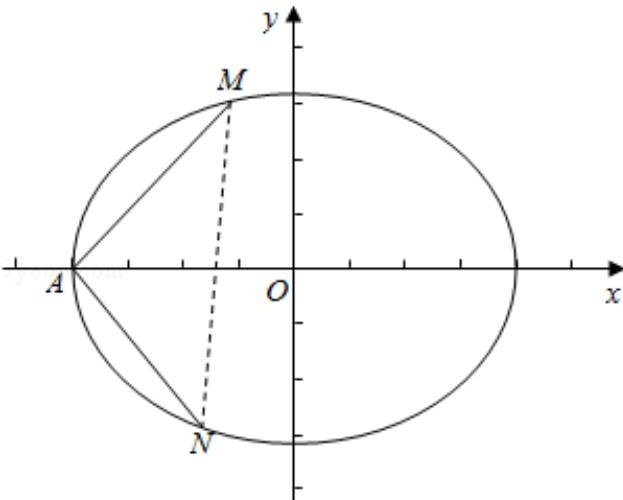

> [!faq]- 2016年全国统一高考数学试卷（文科）（新课标ⅱ）（含解析版）解析
>
> > [!success]- **【答案】** 详见解析
>
> > [!note]- **【分析】**
> > (I)依题意知椭圆E的左顶点A(-2,0)，由 $|AM|=|AN|$ ，且MA⊥NA，可
>
> > [!note]- **【解析】**
> > 分析】(I)依题意知椭圆E的左顶点A(-2,0)，由 $|AM|=|AN|$ ，且MA⊥NA，可
> >
> > 知 $\triangle AMN$ 为等腰直角三角形, 设 $M(a - 2, a)$ , 利用点 $M$ 在 $E$ 上, 可得 $3(a - 2)$
> >
> > $^{2}+4a^{2}=12$ ，解得： $a=\frac{12}{7}$ ，从而可求 $\triangle AMN$ 的面积；
> >
> > (II) 设直线 $I_{AM}$ 的方程为： $y=k(x+2)$ ，直线 $I_{AN}$ 的方程为： $y=-\frac{1}{k}(x+2)$ ，联立
> >
> > $\left\{ \begin{array}{l} y = k(x + 2) \\ 3x^{2} + 4y^{2} = 12 \end{array} \right.$ 消去 $y$ ，得 $(3 + 4k^{2})x^{2} + 16k^{2}x + 16k^{2} - 12 = 0$ ，利用韦达定理及弦长
> >
> > 公式可分别求得 $|\mathsf{AM}| = \sqrt{1 + k^2} |\mathsf{x}_{\mathsf{M}} - (-2)| = \frac{12\sqrt{1 + k^2}}{3 + 4k^2}, |\mathsf{AN}| = \frac{12\sqrt{1 + (\frac{1}{k})^2}}{3 + 4(\frac{1}{k})^2} =$
> >
> > $$
> > \frac {1 2 k \sqrt {1 + k ^ {2}}}{3 k ^ {2} + 4},
> > $$
> >
> > $$
> > 2 | \mathrm{AM} | = | \mathrm{AN} |
> > $$
> >
> > $$
> > \frac {2}{3 + 4 k ^ {2}} = \frac {k}{3 k ^ {2} + 4}
> > $$
> >
> > $$
> > f (k) = 4 k ^ {3} - 6 k ^ {2} + 3 k -
> > $$
> >
> > 8，利用导数法可判断其单调性，再结合零点存在定理即可证得结论成立.
> >
> > 【
> > 解答】解：（I）由椭圆 E 的方程： $\frac{x^{2}}{4}+\frac{y^{2}}{3}=1$ 知，其左顶点 A（-2，0）， $\because |AM|=|AN|$ ，且 MA⊥NA，∴△AMN 为等腰直角三角形，
> >
> > 
> >
> > ∴MN⊥x轴，设M的纵坐标为a，则M（a-2，a），
> >
> > ∵点M在E上，∴3 $(a-2)^{2}+4a^{2}=12$ ，整理得： $7a^{2}-12a=0$ ，∴ $a=\frac{12}{7}$ 或a=0（舍），
> >
> > ∴ $S_{\triangle AMN}=\frac{1}{2}a\times2a=a^{2}=\frac{144}{49}$ ;
> >
> > (Ⅱ) 设直线 $I_{AM}$ 的方程为： $y=k(x+2)$ ，直线 $I_{AN}$ 的方程为： $y=-\frac{1}{k}(x+2)$ ，由 $\left\{\begin{aligned}&y=k(x+2)\\ &3x^{2}+4y^{2}=12\end{aligned}\right.$ 消去 y 得： $(3+4k^{2})x^{2}+16k^{2}x+16k^{2}-12=0,\therefore x_{M}-2=-\frac{16k^{2}}{3+4k^{2}}$
> >
> > $$
> > , \therefore x _ {M} = 2 - \frac {1 6 k ^ {2}}{3 + 4 k ^ {2}} = \frac {6 - 8 k ^ {2}}{3 + 4 k ^ {2}},
> > $$
> >
> > $$
> > \therefore | A M | = \sqrt {1 + k ^ {2}} \left| x _ {M} - (- 2) \right. | = \sqrt {1 + k ^ {2}} \cdot \frac {6 - 8 k ^ {2} + 6 + 8 k ^ {2}}{3 + 4 k ^ {2}} = \frac {1 2 \sqrt {1 + k ^ {2}}}{3 + 4 k ^ {2}}
> > $$
> >
> > $\because k>0,$
> >
> > $$
> > \therefore | A N | = \frac {1 2 \sqrt {1 + \left(\frac {1}{k}\right) ^ {2}}}{3 + 4 \left(\frac {1}{k}\right) ^ {2}} = \frac {1 2 k \sqrt {1 + k ^ {2}}}{3 k ^ {2} + 4},
> > $$
> >
> > 又∵2|AM|=|AN|，∴ $\frac{2}{3+4k^{2}}=\frac{k}{3k^{2}+4}$ ,
> >
> > 整理得： $4k^{3}-6k^{2}+3k-8=0$ ，
> >
> > 设 f (k) = 4k $^{3}$ - 6k $^{2}$ + 3k - 8,
> >
> > 则 $f'$ (k) =12k $^{2}$ - 12k+3=3 (2k - 1) $^{2}\geq0$ ,
> >
> > ∴f (k) =4k $^{3}$ - 6k $^{2}$ +3k - 8 为 (0, +∞) 的增函数，
> >
> > 又 $f(\sqrt{3}) = 4 \times 3\sqrt{3} - 6 \times 3 + 3\sqrt{3} - 8 = 15\sqrt{3} - 26 = \sqrt{675} - \sqrt{676} < 0, f(2) = 4 \times 8 -$
> >
> > $$
> > 6 \times 4 + 3 \times 2 - 8 = 6 > 0,
> > $$
> >
> > $$
> > \therefore \sqrt {3} <   k <   2.
> > $$
> >
> > 【点评】本题考查直线与圆锥曲线的综合问题，常用的方法就是联立方程求出交
> >
> > 点的横坐标或者纵坐标的关系, 通过这两个关系的变形去求解, 考查构造函数
> >
> > 思想与导数法判断函数单调性，再结合零点存在定理确定参数范围，是难题.
> >
> > 请考生在第 22～24 题中任选一题作答，如果多做，则按所做的第一题计分.[选修
> >
> > 4-1：几何证明选讲]
