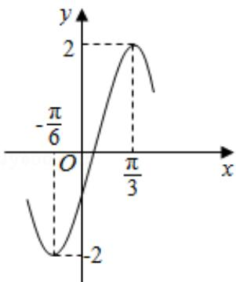

<!-- question-source:start -->
3. （5分）函数 $y = A \sin (\omega x + \varphi)$ 的部分图象如图所示，则（）

A. $y = 2\sin (2x - \frac{\pi}{6})$ B. $y = 2\sin (2x - \frac{\pi}{3})$ C. $y = 2\sin (x + \frac{\pi}{6})$ D. $y = 2\sin (x + \frac{\pi}{3})$
<!-- question-source:end -->

![[高中/真题/按年份分类/2016/2016年全国统一高考数学试卷_文科__新课标ⅱ__含解析版_/选择题/题目/answers/Q00024937A1.md]]
