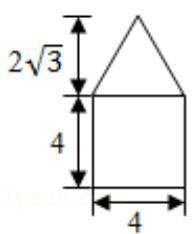
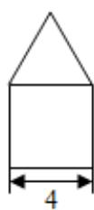
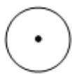

<!-- question-source:start -->
7. (5 分) 如图是由圆柱与圆锥组合而成的几何体的三视图, 则该几何体的表面积为 ( )

A. $20\pi$ B. $24\pi$ C. $28\pi$ D. $32\pi$
<!-- question-source:end -->

![[高中/真题/按年份分类/2016/2016年全国统一高考数学试卷_文科__新课标ⅱ__含解析版_/选择题/题目/answers/Q00024941A1.md]]
