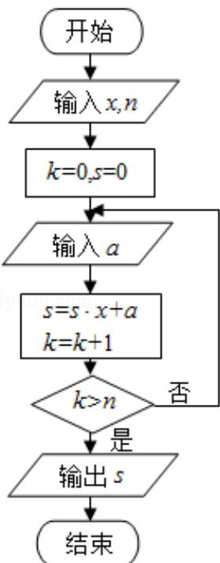

<!-- question-source:start -->
9. (5 分) 中国古代有计算多项式值的秦九韶算法, 如图是实现该算法的程序框图.
执行该程序框图, 若输入的 x=2, n=2, 依次输入的 a 为 2, 2, 5, 则输出的 s=( )

A. 7 B. 12 C. 17 D. 34
<!-- question-source:end -->

![[高中/真题/按年份分类/2016/2016年全国统一高考数学试卷_文科__新课标ⅱ__含解析版_/选择题/题目/answers/Q00024943A1.md]]
