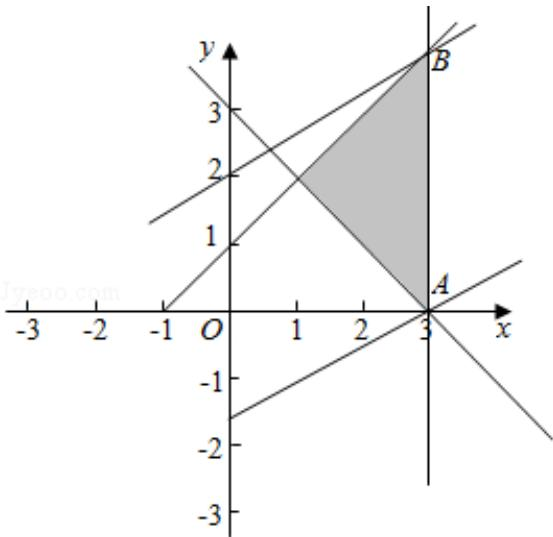

> [!faq]- 2016年全国统一高考数学试卷（文科）（新课标ⅱ）（含解析版）解析
>
> > [!success]- **【答案】** -5
>
> > [!note]- **【分析】**
> > 由约束条件作出可行域，化目标函数为直线方程的斜截式，数形结合得到
>
> > [!note]- **【解析】**
> > 解：由约束条件 $\left\{\begin{aligned}x-y+1&\geqslant0\\ x+y-3&\geqslant0\\ x-3&\leqslant0\end{aligned}\right.$ 作出可行域如图，
> >
> > 联立 $\left\{\begin{aligned}x&=3\\ x-y+1&=0\end{aligned}\right.$ ，解得B（3，4）.
> >
> > 化目标函数 z=x-2y 为 $y=\frac{1}{2}x-\frac{1}{2}z$ ,
> >
> > 由图可知，当直线 $y = \frac{1}{2} x - \frac{1}{2} z$ 过B(3,4)时，直线在y轴上的截距最大，z有最小值
> >
> > 为： $3 - 2 \times 4 = -5$ .
> >
> > 故答案为：-5.
> >
> > 
