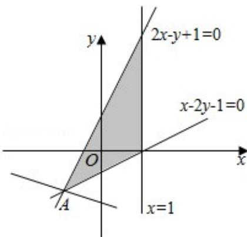

> [!faq]- 2016年全国统一高考数学试卷（文科）（新课标ⅲ）（含解析版）解析
>
> > [!success]- **【答案】** -10
>
> > [!note]- **【分析】**
> > 由约束条件作出可行域，化目标函数为直线方程的斜截式，数形结合得到最优解，联立方程组求得最优解的坐标，代入目标函数得答案.
>
> > [!note]- **【解析】**
> > 解：由约束条件 $\left\{ \begin{array}{l} 2x - y + 1 \geqslant 0 \\ x - 2y - 1 \leqslant 0 \\ x \leqslant 1 \end{array} \right.$ 作出可行域如图，联立 $\left\{ \begin{array}{l} 2x - y + 1 = 0 \\ x - 2y - 1 = 0 \end{array} \right.$ ，解得 $\left\{ \begin{array}{l} x = -1 \\ y = -1 \end{array} \right.$ ，即 $A(-1, -1)$ 。化目标函数 $z = 2x + 3y - 5$ 为 $y = \frac{2}{3} x + \frac{z}{3} + \frac{5}{3}$ 。由图可知，当直线 $y = \frac{2}{3} x + \frac{z}{3} + \frac{5}{3}$ 过 $A$ 时，直线在 $y$ 轴上的截距最小， $z$ 有最小值为 $2 \times (-1) + 3 \times (-1) - 5 = -10$ 。
> >
> > 故答案为：-10.
> >
> > 
