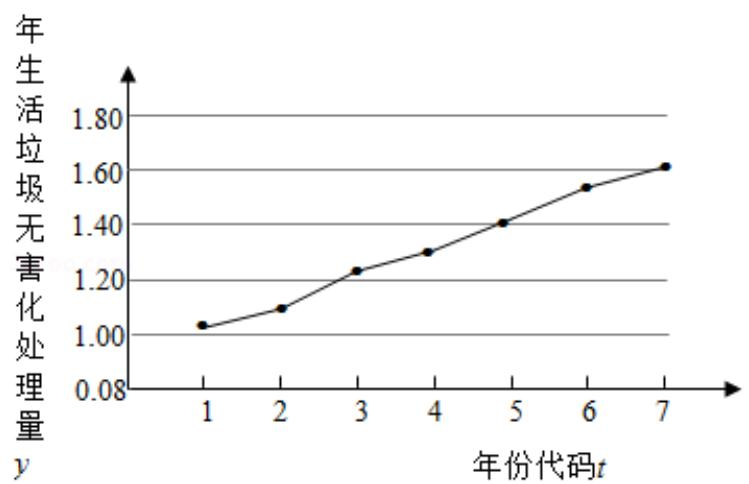

<!-- question-source:start -->
18. (12 分) 如图是我国 2008 年至 2014 年生活垃圾无害化处理量 (单位: 亿吨) 的

折线图.

注：年份代码 1 - 7 分别对应年份 2008 - 2014.

（Ⅰ）由折线图看出，可用线性回归模型拟合 y 与 t 的关系，请用相关系数加以证

明；

（II）建立 y 关于 t 的回归方程（系数精确到 0.01），预测 2016 年我国生活垃圾无

害化处理量.

附注：

参考数据： $\sum_{i = 1}^{7}\mathrm{y}_{i} = 9.32$ ， $\sum_{i = 1}^{7}\mathrm{t}_{i}\mathrm{y}_{i} = 40.17$ ， $\sqrt{\sum_{i = 1}^{7}(y_i - \overline{y})^2} = 0.55$ ， $\sqrt{7}\approx 2.646$

参考公式：相关系数 $r = \frac{\sum_{i=1}^{n}(t_i - \overline{t})(y_i - \overline{y})}{\sqrt{\sum_{i=1}^{n}(t_i - \overline{t})^2\sum_{i=1}^{n}(y_i - \overline{y})^2}}$

回归方程 $\widehat{y} = \widehat{a} +\widehat{bt}$ 中斜率和截距的最小二乘估计公式分别为：

$$
\widehat {b} = \frac {\sum_ {i = 1} ^ {n} (t _ {i} - \overline {{t}}) (y _ {i} - \overline {{y}})}{\sum_ {i = 1} ^ {n} (t _ {i} - \overline {{t}}) ^ {2}}, \quad \widehat {a} = \overline {{y}} - \widehat {b} \overline {{t}}.
$$

<!-- question-source:end -->

![[高中/真题/按年份分类/2016/2016年全国统一高考数学试卷_文科__新课标ⅲ__含解析版_/解答题/题目/answers/Q00024238A1.md]]
