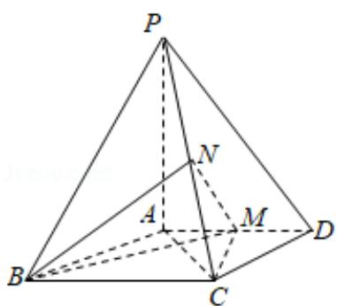

<!-- question-source:start -->
19．（12分）如图，四棱锥 P-ABCD 中，PA⊥底面
ABCD, AD∥BC, AB=AD=AC=3, PA=BC=4, M 为线段 AD 上一点, AM=2MD, N 为 PC 的中点.

（Ⅰ）证明 MN∥平面 PAB；

（II）求四面体 N-BCM 的体积.

<!-- question-source:end -->

![[高中/真题/按年份分类/2016/2016年全国统一高考数学试卷_文科__新课标ⅲ__含解析版_/解答题/题目/answers/Q00024239A1.md]]
