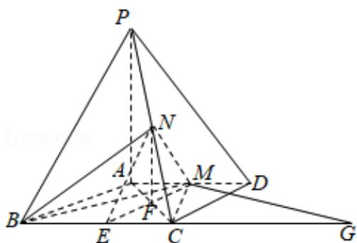

> [!faq]- 2016年全国统一高考数学试卷（文科）（新课标ⅲ）（含解析版）解析
>
> > [!success]- **【答案】** 详见解析
>
> > [!note]- **【分析】**
> > （Ⅰ）取 BC 中点 E，连结 EN，EM，得 NE 是 $\triangle PBC$ 的中位线，推导出四边形
>
> > [!note]- **【解析】**
> > 证明：（Ⅰ）取 BC 中点 E，连结 EN，EM，
> >
> > ∵N 为 PC 的中点，∴NE 是△PBC 的中位线
> >
> > ∴NE∥PB,
> >
> > 又∵AD∥BC，∴BE∥AD，
> >
> > ∵AB=AD=AC=3，PA=BC=4，M为线段AD上一点，AM=2MD，
> >
> > $$
> > \therefore B E = \frac {1}{2} B C = A M = 2,
> > $$
> >
> > ∴四边形 ABEM 是平行四边形，
> >
> > ∴EM∥AB，∴平面 NEM∥平面 PAB，
> >
> > ∵MNC平面 NEM，∴MN∥平面 PAB.
> >
> > 解：（II）取 AC 中点 F，连结 NF，
> >
> > ∵NF 是△PAC 的中位线，
> >
> > $\therefore NF \parallel PA, NF = \frac{1}{2} PA = 2,$
> >
> > 又∵PA⊥面ABCD，∴NF⊥面ABCD，
> >
> > 如图，延长 BC 至 G，使得 CG=AM，连结 GM，
> >
> > ∵AM\_\_\_\_CG，∴四边形 AGCM 是平行四边形，
> >
> > $\therefore AC=MG=3,$
> >
> > 又∵ME=3，EC=CG=2，
> >
> > $\therefore \triangle MEG$ 的高 $h = \sqrt{5}$
> >
> > $$
> > \therefore S _ {\triangle B C M} = \frac {1}{2} \times B C \times h = \frac {1}{2} \times 4 \times \sqrt {5} = 2 \sqrt {5},
> > $$
> >
> > ∴四面体 N-BCM 的体积 $V_{N-BCM}=\frac{1}{3}\times S_{\triangle BCM}\times NF=\frac{1}{3}\times2\sqrt{5}\times2=\frac{4\sqrt{5}}{3}$ .
> >
> > 
> >
> > 【点评】本题考查线面平行的证明，考查四面体的体积的求法，是中档题，解题时
> >
> > 要认真审题，注意空间思维能力的培养。
