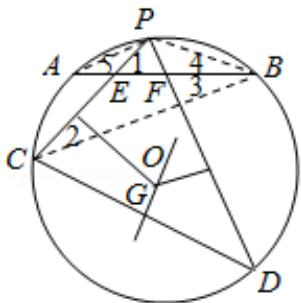

> [!faq]- 2016年全国统一高考数学试卷（文科）（新课标ⅲ）（含解析版）解析
>
> > [!success]- **【答案】** 详见解析
>
> > [!note]- **【分析】**
> > 本题未单列分析。
>
> > [!note]- **【解析】**
> > 解答】（1）解：连接PB，BC，
> >
> > $$
> > \text { 设 } \angle P E B = \angle 1, \angle P C B = \angle 2, \angle A B C = \angle 3,
> > $$
> >
> > $\angle PBA = \angle 4, \angle PAB = \angle 5,$
> >
> > 由 $\odot O$ 中 $\widehat{AB}$ 的中点为P，可得 $\angle4=\angle5$ ，
> >
> > 在 $\triangle EBC$ 中， $\angle1=\angle2+\angle3$ ，
> >
> > 又 $\angle D = \angle 3 + \angle 4, \angle 2 = \angle 5,$
> >
> > 即有 $\angle 2 = \angle 4$ ，则 $\angle D = \angle 1$
> >
> > 则四点 E，C，D，F 共圆，
> >
> > 可得 $\angle EFD + \angle PCD = 180^{\circ}$
> >
> > 由 $\angle PFB = \angle EFD = 2\angle PCD$
> >
> > 即有 $3 \angle PCD = 180^{\circ}$ ,
> >
> > 可得 $\angle PCD=60^{\circ}$ ;
> >
> > (2) 证明: 由 C, D, E, F 共圆,
> >
> > 由 EC 的垂直平分线与 FD 的垂直平分线交于点 G
> >
> > 可得 G 为圆心，即有 GC=GD，
> >
> > 则 G 在 CD 的中垂线，又 CD 为圆 G 的弦，
> >
> > 则 OG⊥CD.
> >
> > 
> >
> > 【点评】本题考查圆内接四边形的性质和四点共圆的判断，以及圆的垂径定理的
> >
> > 运用，考查推理能力，属于中档题.
> >
> > ## [选修 4-4：坐标系与参数方程]
