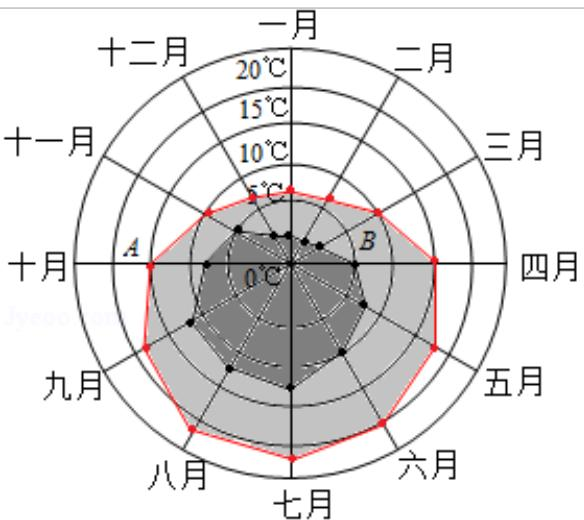

<!-- question-source:start -->
4. (5 分) 某旅游城市为向游客介绍本地的气温情况, 绘制了一年中各月平均最高
气温和平均最低气温的雷达图，图中 A 点表示十月的平均最高气温约为
15°C，B 点表示四月的平均最低气温约为 5°C，下面叙述不正确的是（）

——平均最低气温 —— 平均最高气温
A. 各月的平均最低气温都在 $0^{\circ}$ C 以上
B. 七月的平均温差比一月的平均温差大
C. 三月和十一月的平均最高气温基本相同
D. 平均最高气温高于 $20^{\circ}$ C 的月份有 5 个
<!-- question-source:end -->

![[高中/真题/按年份分类/2016/2016年全国统一高考数学试卷_文科__新课标ⅲ__含解析版_/选择题/题目/answers/Q00024224A1.md]]
