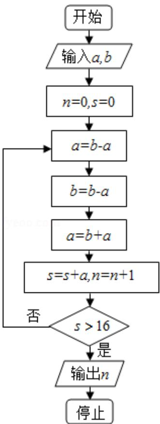

<!-- question-source:start -->
8. （5分）执行如图程序框图，如果输入的 $a = 4$ ， $b = 6$ ，那么输出的 $n =$ （

A. 3 B. 4 C. 5 D. 6
<!-- question-source:end -->

![[高中/真题/按年份分类/2016/2016年全国统一高考数学试卷_文科__新课标ⅲ__含解析版_/选择题/题目/answers/Q00024228A1.md]]
