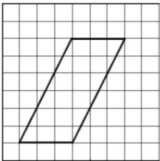
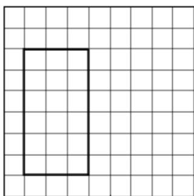
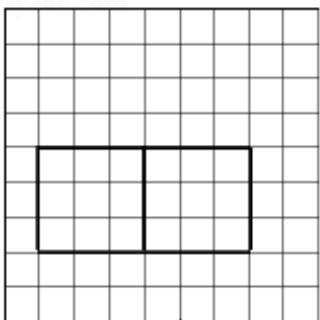

<!-- question-source:start -->
10. (5 分) 如图, 网格纸上小正方形的边长为 1, 粗实线画出的是某多面体的三视
图，则该多面体的表面积为（）

A. $18 + 36\sqrt{5}$ B. $54 + 18\sqrt{5}$ C. 90 D. 81
<!-- question-source:end -->

![[高中/真题/按年份分类/2016/2016年全国统一高考数学试卷_文科__新课标ⅲ__含解析版_/选择题/题目/answers/Q00024230A1.md]]
