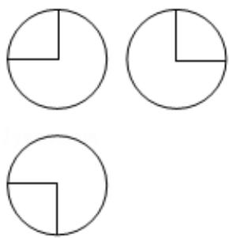
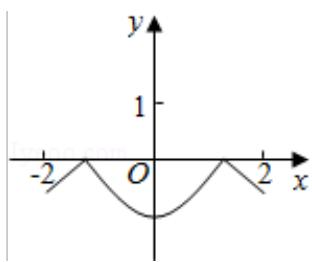
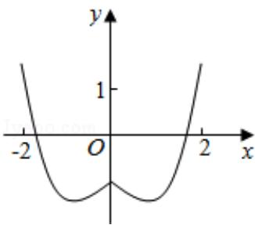
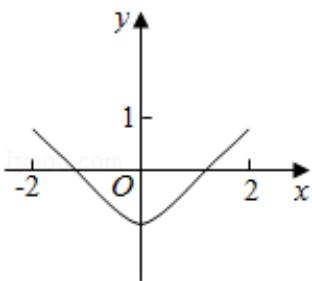
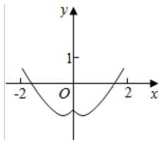
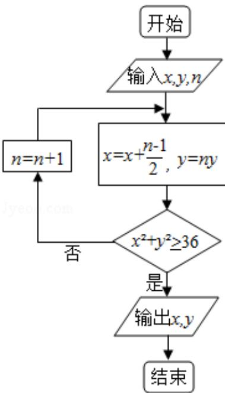
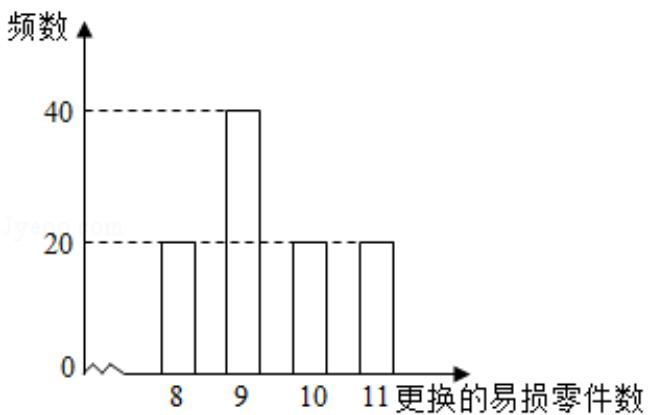

# 2016年全国统一高考数学试卷（理科）（新课标Ⅰ）

项是符合题目要求的.

1. (5分) 设集合 $A = \{x \mid x^2 - 4x + 3 < 0\}$ , $B = \{x \mid 2x - 3 > 0\}$ , 则 $A \cap B = (\quad)$ A. $(-3, -\frac{3}{2})$ B. $(-3, \frac{3}{2})$ C. $(1, \frac{3}{2})$ D. $(\frac{3}{2}, 3)$

2. （5分）设（1+i） $x=1+yi$ ，其中x，y是实数，则 $|x+yi|=(\quad)$ A. 1 B. $\sqrt{2}$ C. $\sqrt{3}$ D. 2

3. (5 分) 已知等差数列 $\{a_{n}\}$ 前 9 项的和为 27, $a_{10} = 8$ , 则 $a_{100} =$ ( )

A. 100 B. 99 C. 98 D. 97

4. (5 分) 某公司的班车在 7:00, 8:00, 8:30 发车, 小明在 7:50 至 8:30 之间到达发车站乘坐班车, 且到达发车站的时刻是随机的, 则他等车时间不超过 10 分钟的概率是 ( )

A. $\frac{1}{3}$ B. $\frac{1}{2}$ C. $\frac{2}{3}$ D. $\frac{3}{4}$

5. (5分) 已知方程 $\frac{x^2}{m^2 + n} - \frac{y^2}{3m^2 - n} = 1$ 表示双曲线, 且该双曲线两焦点间的距离为
4, 则 $n$ 的取值范围是 ( )
A. (-1, 3) B. (-1, $\sqrt{3}$ ) C. (0, 3) D. (0, $\sqrt{3}$ )

6. (5分)如图, 某几何体的三视图是三个半径相等的圆及每个圆中两条相互垂直的半径。若该几何体的体积是 $\frac{28\pi}{3}$ , 则它的表面积是 ( )
A. 17π B. 18π C. 20π D. 28π

7.（5分）函数 $y = 2x^{2} - e^{|x|}$ 在[-2, 2]的图象大致为（）

A.

B.

C.

D.

8. （5分）若 $a > b > 1, 0 < c < 1$ ，则（）
A. $a^{c} < b^{c}$ B. $ab^{c} < ba^{c}$ C. $alog_{b}c < blog_{a}c$ D. $log_{a}c < log_{b}c$

9. (5 分) 执行下面的程序框图, 如果输入的 $x = 0, y = 1, n = 1$ , 则输出 $x, y$ 的值满足 (

A. $y = 2x$ B. $y = 3x$ C. $y = 4x$ D. $y = 5x$

10. (5 分) 以抛物线 C 的顶点为圆心的圆交 C 于 A、B 两点, 交 C 的准线于 D、E 两点. 已知 $|AB| = 4\sqrt{2}$ , $|DE| = 2\sqrt{5}$ , 则 C 的焦点到准线的距离为 ( )

A. 2

B. 4

C. 6

D. 8

11. （5分）平面 $\alpha$ 过正方体 $ABCD - A_{1}B_{1}C_{1}D_{1}$ 的顶点 $A, \alpha \parallel$ 平面 $CB_{1}D_{1}, \alpha \cap$ 平面 $ABCD = m, \alpha \cap$ 平面 $ABB_{1}A_{1} = n$ ，则 $m, n$ 所成角的正弦值为（）
A. $\frac{\sqrt{3}}{2}$ B. $\frac{\sqrt{2}}{2}$ C. $\frac{\sqrt{3}}{3}$ D. $\frac{1}{3}$

12. (5 分) 已知函数 $f(x) = \sin (\omega x + \varphi) (\omega > 0, |\varphi| \leq \frac{\pi}{2})$ , $x = -\frac{\pi}{4}$ 为 $f(x)$ 的零点， $x = \frac{\pi}{4}$ 为 $y = f(x)$ 图象的对称轴，且 $f(x)$ 在 $(\frac{\pi}{18}, \frac{5\pi}{36})$ 上单调，则 $\omega$ 的最大值为（

A. 11 B. 9 C. 7 D. 5

##
二、填空题：本大题共4小题，每小题5分，共20分.

13. (5分) 设向量 $\vec{a}=(m,1)$ , $\vec{b}=(1,2)$ , 且 $|\vec{a}+\vec{b}|^{2}=|\vec{a}|^{2}+|\vec{b}|^{2}$ , 则 m= \_\_\_\_.  
14. (5分) $(2x+\sqrt{x})^{5}$ 的展开式中， $x^{3}$ 的系数是 \_\_\_\_。（用数字填写
答案）  
15. (5分) 设等比数列 $\{a_{n}\}$ 满足 $a_{1}+a_{3}=10$ , $a_{2}+a_{4}=5$ , 则 $a_{1}a_{2}\ldots a_{n}$ 的最大值为 \_\_\_\_.
16. (5分) 某高科技企业生产产品 A 和产品 B 需要甲、乙两种新型材料。生产一件
产品 A 需要甲材料 1.5kg，乙材料 1kg，用 5 个工时；生产一件产品 B 需要甲材
料 0.5kg，乙材料 0.3kg，用 3 个工时，生产一件产品 A 的利润为 2100 元，生产
一件产品 B 的利润为 900 元。该企业现有甲材料 150kg，乙材料 90kg，则在不
超过 600 个工时的条件下，生产产品 A、产品 B 的利润之和的最大值为 \_\_\_\_ 元。

##
三、解答题: 本大题共 5 小题, 满分 60 分,

解答须写出文字说明、证明过程或演算步骤.

17. （12分） $\triangle ABC$ 的内角 A, B, C 的对边分别为 a, b, c, 已知

2cosC (acosB+bcosA) =c.

(Ⅰ) 求 c;

（II）若 $c=\sqrt{7}$ ，△ABC 的面积为 $\frac{3\sqrt{3}}{2}$ ，求△ABC 的周长.

18. （12分）如图，在以A，B，C，D，E，F为顶点的五面体中，面ABEF为正方形，AF=2FD， $\angle AFD=90^{\circ}$ ，且二面角D-AF-E与二面角C-BE-F都是 $60^{\circ}$ .

（Ⅰ）证明平面 ABEF⊥平面 EFDC；

（II）求二面角 E - BC - A 的余弦值.

19.（12分）某公司计划购买2台机器，该种机器使用三年后即被淘汰。机器有一

易损零件，在购进机器时，可以额外购买这种零件作为备件，每个200元.在机

器使用期间，如果备件不足再购买，则每个500元．现需决策在购买机器时应

同时购买几个易损零件，为此搜集并整理了100台这种机器在三年使用期内

更换的易损零件数，得如图柱状图：

以这 100 台机器更换的易损零件数的频率代替 1 台机器更换的易损零件数发生

的概率，记X表示2台机器三年内共需更换的易损零件数，n表示购买2台机

器的同时购买的易损零件数.

（Ⅰ）求 $x$ 的分布列；

（II）若要求 P ( $X \leq n$ ) $\geqslant 0.5$ ，确定 n 的最小值；

（III）以购买易损零件所需费用的期望值为决策依据，在 $n = 19$ 与 $n = 20$ 之中选其

## 一，应选用哪个？

20.（12分）设圆 $x^{2}+y^{2}+2x-15=0$ 的圆心为A，直线l过点B(1,0)且与x轴不重合，

I 交圆 A 于 C，D 两点，过 B 作 AC 的平行线交 AD 于点 E.

（Ⅰ）证明 $|EA| + |EB|$ 为定值，并写出点E的轨迹方程；

（II）设点 E 的轨迹为曲线 $C_{1}$ ，直线 I 交 $C_{1}$ 于 M，N 两点，过 B 且与 I 垂直的直线与

圆 A 交于 P，Q 两点，求四边形 MPNQ 面积的取值范围.

21. (12 分) 已知函数 $f(x) = (x - 2)e^x + a(x - 1)^2$ 有两个零点.

(Ⅰ) 求 a 的取值范围;

（Ⅱ）设 $x_{1}, x_{2}$ 是 $f(x)$ 的两个零点，证明： $x_{1} + x_{2} < 2$ 。

请考生在 22、23、24 题中任选一题作答, 如果多做, 则按所做的第一题计分.[选修

4-1：几何证明选讲]

22. (10 分) 如图, $\triangle OAB$ 是等腰三角形, $\angle AOB = 120^{\circ}$ . 以 $O$ 为圆心, $\frac{1}{2} OA$ 为半径

作圆.

（Ⅰ）证明：直线 AB 与 $\odot O$ 相切；

（II）点 C，D 在 $\odot O$ 上，且 A，B，C，D 四点共圆，证明：AB $\parallel$ CD.

[选修 4-4：坐标系与参数方程]

23. 在直角坐标系 xOy 中，曲线 $C_{1}$ 的参数方程为 $\left\{\begin{aligned}x&=acost\\ y&=1+asint\end{aligned}\right.$ （t 为参数，a>0）。在以坐标原点为极点，x 轴正半轴为极轴的极坐标系中，曲线 $C_{2}:\rho=4\cos\theta$ 。

（Ⅰ）说明 $C_{1}$ 是哪种曲线，并将 $C_{1}$ 的方程化为极坐标方程；

（II）直线 $C_3$ 的极坐标方程为 $\theta = \alpha_0$ ，其中 $\alpha_0$ 满足 $\tan \alpha_0 = 2$ ，若曲线 $C_1$ 与 $C_2$ 的公共点

都在 $C_3$ 上，求a.

[选修 4-5：不等式选讲]

24. 已知函数 $f(x) = |x + 1| - |2x - 3|$ .

（Ⅰ）在图中画出 y=f（x）的图象；

（Ⅱ）求不等式 $|f(x)| > 1$ 的解集.

<table><tr><td></td><td></td><td></td><td></td><td></td><td></td><td></td><td></td><td></td><td></td><td></td><td></td><td></td><td></td><td></td><td></td><td></td><td></td><td></td><td></td><td></td><td></td><td></td><td></td><td></td><td></td><td></td><td></td><td></td><td></td><td></td><td></td><td></td><td></td><td></td><td></td><td></td><td></td><td></td><td></td><td></td><td></td><td></td><td></td><td></td><td></td><td></td><td></td><td></td><td></td><td></td><td></td><td></td><td></td><td></td><td></td><td></td><td></td><td></td><td></td><td></td><td></td><td></td><td></td><td></td><td></td><td></td><td></td><td></td><td></td><td></td><td></td><td></td><td></td><td></td><td></td><td></td><td></td><td></td><td></td><td></td><td></td><td></td><td></td><td></td><td></td><td></td><td></td><td></td><td></td><td></td><td></td><td></td><td></td><td></td><td></td><td></td><td></td><td></td><td></td></tr><tr><td></td><td></td><td></td><td></td><td></td><td></td><td></td><td></td><td></td><td></td><td></td><td></td><td></td><td></td><td></td><td></td><td></td><td></td><td></td><td></td><td></td><td></td><td></td><td></td><td></td><td></td><td></td><td></td><td></td><td></td><td></td><td></td><td></td><td></td><td></td><td></td><td></td><td></td><td></td><td></td><td></td><td></td><td></td><td></td><td></td><td></td><td></td><td></td><td></td><td></td><td></td><td></td><td></td><td></td><td></td><td></td><td></td><td></td><td></td><td></td><td></td><td></td><td></td><td></td><td></td><td></td><td></td><td></td><td></td><td></td><td></td><td></td><td></td><td></td><td></td><td></td><td></td><td></td><td></td><td></td><td></td><td></td><td></td><td></td><td></td><td></td><td></td><td></td><td></td><td></td><td></td><td></td><td></td><td></td><td></td><td></td><td></td><td></td><td></td><td></td></tr></table>

# 2016年全国统一高考数学试卷（理科）（新课标Ⅰ）

参考
答案与
试题
解析

##

![[高中/真题/按年份分类/2016/2016年全国统一高考数学试卷_理科__新课标ⅰ__含解析版_/选择题/选择题.md]]
![[高中/真题/按年份分类/2016/2016年全国统一高考数学试卷_理科__新课标ⅰ__含解析版_/填空题/填空题.md]]
![[高中/真题/按年份分类/2016/2016年全国统一高考数学试卷_理科__新课标ⅰ__含解析版_/解答题/解答题.md]]
