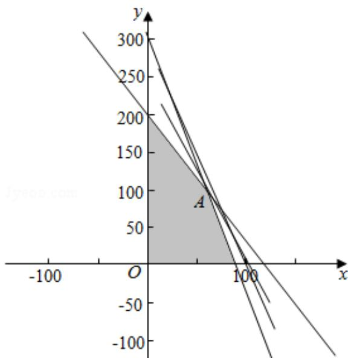

> [!faq]- 2016年全国统一高考数学试卷（理科）（新课标ⅰ）（含解析版）解析
>
> > [!success]- **【答案】** 为：216000.  【点评】本题考查了列二元一次方程组解实际问题的运用，二元一次方程组的解法的运用，不等式组解实际问题的运用，不定方程解实际问题的运用，
>
> > [!note]- **【分析】**
> > 设 A、B 两种产品分别是 x 件和 y 件，根据题干的等量关系建立不等式组以
>
> > [!note]- **【解析】**
> > 分析】设 A、B 两种产品分别是 x 件和 y 件，根据题干的等量关系建立不等式组以
> >
> > 及目标函数，利用线性规划作出可行域，通过目标函数的几何意义，求出其最
> >
> > 大值即可；
> >
> > 【
> > 解答】解：（1）设 A、B 两种产品分别是 x 件和 y 件，获利为 z 元.
> >
> > 由题意，得 $\left\{\begin{aligned}x&\in N, y\in N\\ 1.5x+0.5y&\leqslant150\\ x+0.3y&\leqslant90\\ 5x+3y&\leqslant600\end{aligned}\right.$ ，z=2100x+900y.
> >
> > 不等式组表示的可行域如图：由题意可得 $\left\{\begin{aligned}x+0.3y&=90\\ 5x+3y&=600\end{aligned}\right.$ ，解得： $\left\{\begin{aligned}x&=60\\ y&=100\end{aligned}\right.$ ，
> > A（60，100），
> >
> > 目标函数 $z=2100x+900y$ 。经过 A 时，直线的截距最大，目标函数取得最大值： $2100\times60+900\times100=216000$ 元。
> >
> > 故
> > 答案为：216000.
> >
> > 
> >
> > 【点评】本题考查了列二元一次方程组解实际问题的运用，二元一次方程组的解法的运用，不等式组解实际问题的运用，不定方程解实际问题的运用，
> > 解答时
> >
> > 求出最优解是解题的关键.
> >
> > ## 三、解答题: 本大题共 5 小题, 满分 60 分,
> >
> > 解答须写出文字说明、证明过程或演算
> >
> > 步骤.
