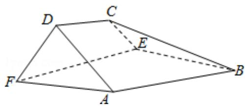

<!-- question-source:start -->
18.（12分）如图，在以A，B，C，D，E，F为顶点的五面体中，面ABEF为正方形，

AF=2FD， $\angle AFD=90^{\circ}$ ，且二面角D-AF-E与二面角C-BE-F都是 $60^{\circ}$ .

（Ⅰ）证明平面 ABEF⊥平面 EFDC；

（II）求二面角 E - BC - A 的余弦值.

【考点】MJ：二面角的平面角及求法.

【专题】11: 计算题; 34: 方程思想; 49: 综合法; 5H: 空间向量及应用; 5Q: 立体几

何.

【
<!-- question-source:end -->

![[高中/真题/按年份分类/2016/2016年全国统一高考数学试卷_理科__新课标ⅰ__含解析版_/解答题/题目/answers/Q00028482A1.md]]
