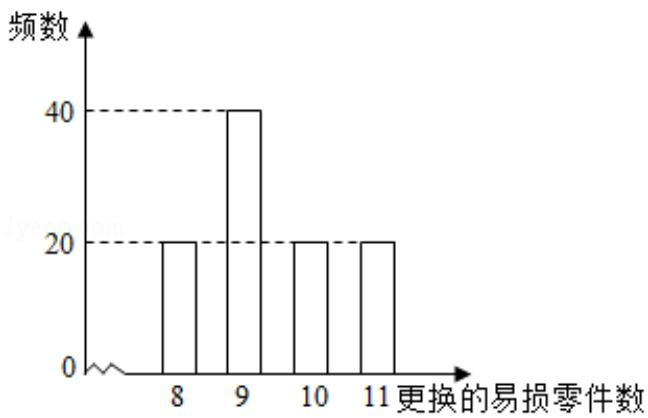

<!-- question-source:start -->
19.（12分）某公司计划购买2台机器，该种机器使用三年后即被淘汰。机器有一

易损零件, 在购进机器时, 可以额外购买这种零件作为备件, 每个 200 元. 在机

器使用期间，如果备件不足再购买，则每个 500 元．现需决策在购买机器时应

同时购买几个易损零件，为此搜集并整理了100台这种机器在三年使用期内

更换的易损零件数，得如图柱状图：

以这 100 台机器更换的易损零件数的频率代替 1 台机器更换的易损零件数发生

的概率，记X表示2台机器三年内共需更换的易损零件数，n表示购买2台机

器的同时购买的易损零件数.

(Ⅰ) 求 x 的分布列;

（II）若要求 P (X≤n) ≥0.5，确定 n 的最小值；

（III）以购买易损零件所需费用的期望值为决策依据，在 $n = 19$ 与 $n = 20$ 之中选其

## 一，应选用哪个？

【考点】CG：离散型随机变量及其分布列.

【专题】11：计算题；35：转化思想；49：综合法；5I：概率与统计.

【
<!-- question-source:end -->

![[高中/真题/按年份分类/2016/2016年全国统一高考数学试卷_理科__新课标ⅰ__含解析版_/解答题/题目/answers/Q00028483A1.md]]
