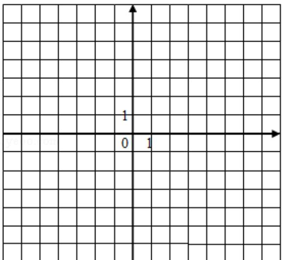

<!-- question-source:start -->
24. 已知函数 $f(x) = |x + 1| - |2x - 3|$ .

（Ⅰ）在图中画出 y=f（x）的图象；

（Ⅱ）求不等式 $|f(x)| > 1$ 的解集.

【考点】&2：带绝对值的函数；3A：函数的图象与图象的变换.

【专题】35：转化思想；48：分析法；59：不等式的解法及应用.
<!-- question-source:end -->

![[高中/真题/按年份分类/2016/2016年全国统一高考数学试卷_理科__新课标ⅰ__含解析版_/解答题/题目/answers/Q00031643A1.md]]
