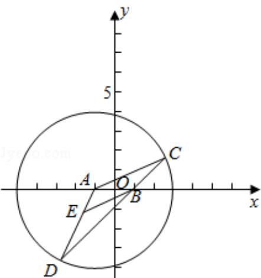

> [!faq]- 2016年全国统一高考数学试卷（理科）（新课标ⅰ）（含解析版）解析
>
> > [!success]- **【答案】** 详见解析
>
> > [!note]- **【分析】**
> > 法; 5B: 直线与圆; 5D: 圆锥曲线的定义、性质与方
>
> > [!note]- **【解析】**
> > 分析法; 5B: 直线与圆; 5D: 圆锥曲线的定义、性质与方
> >
> > 程.
> >
> > 【
> > 分析】（Ⅰ）求得圆 A 的圆心和半径，运用直线平行的性质和等腰三角形的性质
> >
> > 可得 $EB = ED$ ，再由圆的定义和椭圆的定义，可得 $E$ 的轨迹为以 $A, B$ 为焦点的椭
> >
> > 圆，求得 a, b, c，即可得到所求轨迹方程；
> >
> > （II）设直线 $I: x=my+1$ ，代入椭圆方程，运用韦达定理和弦长公式，可得 $|MN|$ ，由
> >
> > PQ⊥l，设 PQ: y = -m (x - 1)，求得 A 到 PQ 的距离，再由圆的弦长公式可得
> >
> > PQ|, 再由四边形的面积公式, 化简整理, 运用不等式的性质, 即可得到所求范
> >
> > 围.
> >
> > 【
> > 解答】解：（Ⅰ）证明：圆 $x^{2}+y^{2}+2x-15=0$ 即为 $(x+1)^{2}+y^{2}=16$ ，
> >
> > 可得圆心 A（-1，0），半径 r=4，
> >
> > 由 BE∥AC，可得 $\angle C = \angle EBD$ ，
> >
> > 由 AC=AD，可得 $\angle D=\angle C$ ，
> >
> > 即为 $\angle D = \angle EBD$ ，即有 $EB = ED$
> >
> > 则 $|EA| + |EB| = |EA| + |ED| = |AD| = 4$ ,
> >
> > 故 E 的轨迹为以 A，B 为焦点的椭圆，
> >
> > 且有 2a=4，即 a=2，c=1， $b=\sqrt{a^{2}-c^{2}}=\sqrt{3}$ ，
> >
> > 则点 E 的轨迹方程为 $\frac{x^{2}}{4}+\frac{y^{2}}{3}=1$ （y=0）；
> >
> > （II）椭圆 $C_1: \frac{x^2}{4} + \frac{y^2}{3} = 1$ ，设直线 $l: x = my + 1$
> >
> > 由 PQ⊥l，设 PQ: y = -m (x - 1)，
> >
> > 由 $\left\{\begin{aligned}x=my+1\\ 3x^{2}+4y^{2}=12\end{aligned}\right.$ 可得 $(3m^{2}+4)y^{2}+6my-9=0,$
> >
> > 设 M $(x_{1}, y_{1})$ ，N $(x_{2}, y_{2})$ ，
> >
> > 可得 $y_{1}+y_{2}=-\frac{6m}{3m^{2}+4}$ ， $y_{1}y_{2}=-\frac{9}{3m^{2}+4}$ ，
> >
> > $$
> > \left| M N \right| = \sqrt {1 + m ^ {2}} \bullet \left| y _ {1} - y _ {2} \right| = \sqrt {1 + m ^ {2}} \bullet \sqrt {\frac {3 6 m ^ {2}}{\left(3 m ^ {2} + 4\right) ^ {2}} + \frac {3 6}{3 m ^ {2} + 4}}
> > $$
> >
> > $$
> > = \sqrt {1 + m ^ {2}} \cdot \frac {\sqrt {3 6 (4 m ^ {2} + 4)}}{3 m ^ {2} + 4} = 1 2 \cdot \frac {1 + m ^ {2}}{3 m ^ {2} + 4},
> > $$
> >
> > A到PQ的距离为 $d = \frac{|-m(-1 - 1)|}{\sqrt{1 + m^2}} = \frac{|2m|}{\sqrt{1 + m^2}}$
> >
> > $$
> > \left| P Q \right| = 2 \sqrt {r ^ {2} - d ^ {2}} = 2 \sqrt {1 6 - \frac {4 m ^ {2}}{1 + m ^ {2}}} = \frac {4 \sqrt {3 m ^ {2} + 4}}{\sqrt {1 + m ^ {2}}},
> > $$
> >
> > 则四边形 MPNQ 面积为 $S=\frac{1}{2}|PQ|\bullet|MN|=\frac{1}{2}\bullet\frac{4\sqrt{3m^{2}+4}}{\sqrt{1+m^{2}}}\bullet12\bullet\frac{1+m^{2}}{3m^{2}+4}$ $=24\bullet\frac{\sqrt{1+m^{2}}}{\sqrt{3m^{2}+4}}=24\sqrt{\frac{1}{3+\frac{1}{1+m^{2}}}}$ 当 m=0 时，S 取得最小值 12，又 $\frac{1}{1+m^{2}}>0$ ，可得 $S<24\bullet\frac{\sqrt{3}}{3}=8\sqrt{3}$ ，即有四边形 MPNQ 面积的取值范围是 $[12,8\sqrt{3})$ 。
> >
> > 
> >
> > 【点评】本题考查轨迹方程的求法, 注意运用椭圆和圆的定义, 考查直线和椭圆方
> > 程联立, 运用韦达定理和弦长公式, 以及直线和圆相交的弦长公式, 考查不等
> > 式的性质, 属于中档题.
