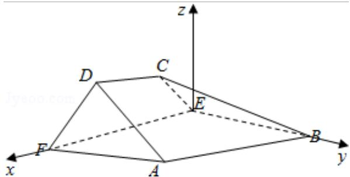

> [!faq]- 2016年全国统一高考数学试卷（理科）（新课标ⅰ）（含解析版）解析
>
> > [!success]- **【答案】** 详见解析
>
> > [!note]- **【分析】**
> > （Ⅰ）证明 AF⊥平面 EFDC，利用平面与平面垂直的判定定理证明平面
>
> > [!note]- **【解析】**
> > 分析】（Ⅰ）证明 AF⊥平面 EFDC，利用平面与平面垂直的判定定理证明平面
> >
> > ABEF⊥平面 EFDC;
> >
> > （II）证明四边形 EFDC 为等腰梯形，以 E 为原点，建立如图所示的坐标系，求出平
> >
> > 面 BEC、平面 ABC 的法向量，代入向量夹角公式可得二面角 E-BC-A 的余弦
> >
> > 值.
> >
> > 【
> > 解答】（Ⅰ）证明：∵ABEF为正方形，∴AF⊥EF.
> >
> > $\because \angle AFD=90^{\circ}, \therefore AF\perp DF,$
> >
> > ∵DF∩EF=F,
> >
> > ∴AF⊥平面 EFDC，
> >
> > ∵AFC平面ABEF，
> >
> > ∴平面 ABEF⊥平面 EFDC;
> >
> > （II）解：由 AF⊥DF，AF⊥EF，
> >
> > 可得 $\angle DFE$ 为二面角D-AF-E的平面角；
> >
> > 由 ABEF 为正方形，AF⊥平面 EFDC，
> >
> > ∵BE⊥EF,
> >
> > ∴BE⊥平面 EFDC
> >
> > 即有 CE⊥BE，
> >
> > 可得 $\angle CEF$ 为二面角C-BE-F的平面角.
> >
> > 可得 $\angle DFE = \angle CEF = 60^{\circ}$
> >
> > ∵AB∥EF，AB∉平面 EFDC，EFC平面 EFDC，
> >
> > ∴AB∥平面 EFDC，
> >
> > ∵平面 EFDC∩平面 ABCD=CD，ABC⊂平面 ABCD，
> >
> > $\therefore AB\|CD,$
> >
> > $\therefore CD\|EF,$
> >
> > ∴四边形 EFDC 为等腰梯形.
> >
> > 以 E 为原点，建立如图所示的坐标系，设 FD=a，则 E (0, 0, 0), B (0, 2a, 0), C ( $\frac{a}{2}$ , 0, $\frac{\sqrt{3}}{2}a$ ), A (2a, 2a, 0), $\therefore\overrightarrow{EB}=(0,2a,0),\overrightarrow{BC}=(\frac{a}{2},-2a,\frac{\sqrt{3}}{2}a),\overrightarrow{AB}=(-2a,0,0)$ 设平面 BEC 的法向量为 $\vec{\pi}=(x_{1},y_{1},z_{1})$ ，则 $\left\{\begin{aligned}\vec{m}\cdot\vec{EB}&=0\\ \vec{m}\cdot\vec{BC}&=0\end{aligned}\right.$ 则 $\left\{\begin{aligned}2ay_{1}&=0\\ \frac{a}{2}x_{1}-2ay_{1}+\frac{\sqrt{3}}{2}az_{1}&=0\end{aligned}\right.$ ，取 $\vec{\pi}=(\sqrt{3},0,-1)$ .
> > 设平面 ABC 的法向量为 $\vec{n}=(x_{2},y_{2},z_{2})$ ，则 $\left\{\begin{aligned}\vec{n}\cdot\vec{BC}&=0\\ \vec{n}\cdot\vec{AB}&=0\end{aligned}\right.$ 则 $\left\{\begin{aligned}\frac{a}{2}x_{2}-2ay_{2}+\frac{\sqrt{3}}{2}az_{2}&=0\\ 2ax_{2}&=0\end{aligned}\right.$ ，取 $\vec{n}=(0,\sqrt{3},4)$ .
> > 设二面角 E - BC - A 的大小为 $\theta$ ，则 $\cos\theta=\frac{\vec{m}\cdot\vec{n}}{|\vec{m}|\cdot|\vec{n}|}$ $=\frac{-4}{\sqrt{3+1}\cdot\sqrt{3+16}}=-\frac{2\sqrt{19}}{19}$ 则二面角 E - BC - A 的余弦值为 $-\frac{2\sqrt{19}}{19}$ .
> >
> > 
> >
> > 【点评】本题考查平面与平面垂直的证明, 考查用空间向量求平面间的夹角, 建立
> > 空间坐标系将二面角问题转化为向量夹角问题是
> > 解答的关键.
