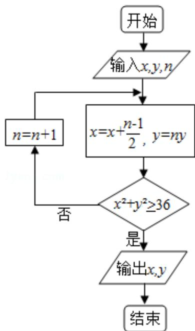

<!-- question-source:start -->
9. (5 分) 执行下面的程序框图, 如果输入的 $x = 0, y = 1, n = 1$ , 则输出 $x, y$ 的值满足 ( )

A. $y = 2x$ B. $y = 3x$ C. $y = 4x$ D. $y = 5x$

【考点】EF：程序框图.

【专题】11：计算题；28：操作型；5K：算法和程序框图.

【
<!-- question-source:end -->

![[高中/真题/按年份分类/2016/2016年全国统一高考数学试卷_理科__新课标ⅰ__含解析版_/选择题/题目/answers/Q00026929A1.md]]
