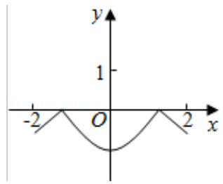
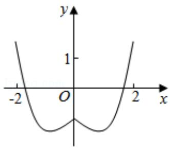
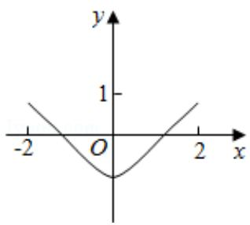
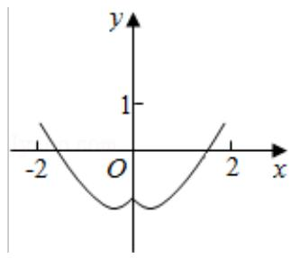

<!-- question-source:start -->
7.（5分）函数 $y = 2x^{2} - e^{|x|}$ 在[-2, 2]的图象大致为（）

A.

B.

C.

D.

【考点】3A：函数的图象与图象的变换.

【专题】27：图表型；48：分析法；51：函数的性质及应用.
<!-- question-source:end -->

![[高中/真题/按年份分类/2016/2016年全国统一高考数学试卷_理科__新课标ⅰ__含解析版_/选择题/题目/answers/Q00030546A1.md]]
