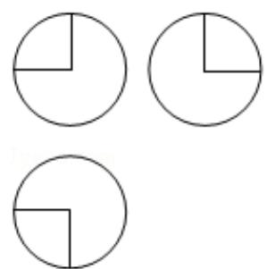

> [!faq]- 2016年全国统一高考数学试卷（理科）（新课标ⅰ）（含解析版）解析
>
> > [!success]- **【答案】** A
>
> > [!note]- **【分析】**
> > 由已知可得 c=2，利用 $4=(m^{2}+n)+(3m^{2}-n)$ ，解得 $m^{2}=1$ ，又 $(m^{2}+n)(3m^{2}$
>
> > [!note]- **【解析】**
> > 解：∵双曲线两焦点间的距离为4，∴c=2，
> >
> > 
> >
> > 当焦点在 x 轴上时，
> >
> > 可得： $4=(m^{2}+n)+(3m^{2}-n)$ ，解得： $m^{2}=1$ ，
> >
> > ∵方程 $\frac{x^{2}}{m^{2}+n}-\frac{y^{2}}{3m^{2}-n}=1$ 表示双曲线，
> >
> > ∴ $(m^{2}+n)$ $(3m^{2}-n)>0$ ，可得： $(n+1)$ $(3-n)>0$ ，
> >
> > 解得：-1<n<3，即n的取值范围是： $(-1,3)$ .
> >
> > 当焦点在 y 轴上时，
> >
> > 可得： $-4=(m^{2}+n)+(3m^{2}-n)$ ，解得： $m^{2}=-1$ ，
> >
> > 无解.
> >
> > 故选：A.
> >
> > 【点评】本题主要考查了双曲线方程的应用，考查了不等式的解法，属于基础题.
