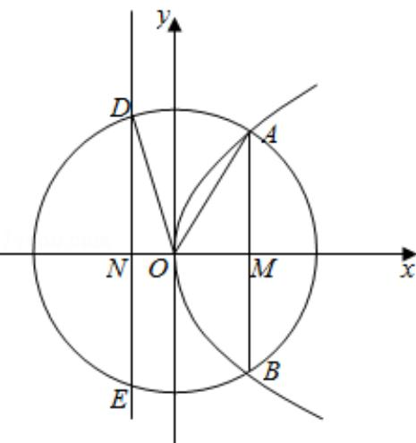

> [!faq]- 2016年全国统一高考数学试卷（理科）（新课标ⅰ）（含解析版）解析
>
> > [!success]- **【答案】** B
>
> > [!note]- **【分析】**
> > 画出图形, 设出抛物线方程, 利用勾股定理以及圆的半径列出方程求解即可.
>
> > [!note]- **【解析】**
> > 解：设抛物线为 $y^{2}=2px$ ，如图： $|AB|=4\sqrt{2}$ ， $|AM|=2\sqrt{2}$ ，
> >
> > $$
> > \left| D E \right| = 2 \sqrt {5}, \quad \left| D N \right| = \sqrt {5}, \quad \left| O N \right| = \frac {p}{2},
> > $$
> >
> > $$
> > x _ {A} = \frac {(2 \sqrt {2}) ^ {2}}{2 p} = \frac {4}{p},
> > $$
> >
> > $$
> > \left| \mathrm{OD} \right| = \left| \mathrm{OA} \right|,
> > $$
> >
> > $$
> > \frac {1 6}{p ^ {2}} + 8 = \frac {p ^ {2}}{4} + 5,
> > $$
> >
> > 解得：p=4.
> >
> > C 的焦点到准线的距离为：4.
> >
> > 故选：B.
> >
> > 
> >
> > 【点评】本题考查抛物线的简单性质的应用, 抛物线与圆的方程的应用, 考查计算能力. 转化思想的应用.
