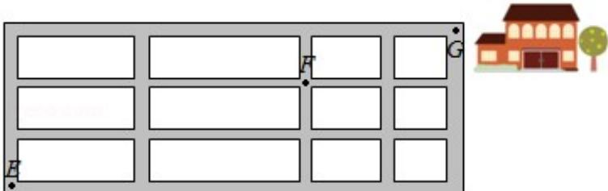
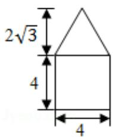
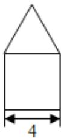
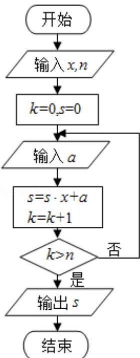

# 2016年全国统一高考数学试卷（理科）（新课标Ⅱ）

是符合题目要求的。

1. (5 分) 已知 $z = (m + 3) + (m - 1)i$ 在复平面内对应的点在第四象限, 则实数 $m$ 的取值范围是 ( )

A. (-3, 1) B. (-1, 3) C. (1, +∞) D. (-∞, -3)

2. (5 分) 已知集合 $A = \{1, 2, 3\}$ , $B = \{x \mid (x + 1) (x - 2) < 0, x \in \mathbb{Z}\}$ , 则 AUB 等于 ( ) A. {1} B. {1, 2} C. {0, 1, 2, 3} D. {-1, 0, 1, 2, 3}

3. (5分) 已知向量 $\vec{a} = (1, m)$ , $\vec{b} = (3, -2)$ , 且 $(\vec{a} + \vec{b}) \perp \vec{b}$ , 则 $m = (\quad)$ A. -8 B. -6 C. 6 D. 8

4. (5分) 圆 $x^{2} + y^{2} - 2x - 8y + 13 = 0$ 的圆心到直线 $ax + y - 1 = 0$ 的距离为 1, 则 $a = (\quad)$ A. $-\frac{4}{3}$ B. $-\frac{3}{4}$ C. $\sqrt{3}$ D. 2

5.（5分）如图，小明从街道的E处出发，先到F处与小红会合，再一起到位于G处的老年公寓参加志愿者活动，则小明到老年公寓可以选择的最短路径条数
为（）

A. 24 B. 18 C. 12 D. 9

6.（5 分）如图是由圆柱与圆锥组合而成的几何体的三视图，则该几何体的表面积为（）

A. $20\pi$ B. $24\pi$ C. $28\pi$ D. $32\pi$

7. (5分) 若将函数 $y = 2\sin 2x$ 的图象向左平移 $\frac{\pi}{12}$ 个单位长度, 则平移后的图象的对称轴为 ( )

A. $x = \frac{k\pi}{2} - \frac{\pi}{6}$ ( $k \in \mathbb{Z}$ )

B. $x = \frac{k\pi}{2} + \frac{\pi}{6}$ ( $k \in \mathbb{Z}$ )

C. $x = \frac{k\pi}{2} - \frac{\pi}{12}$ ( $k \in \mathbb{Z}$ )

D. $x = \frac{k\pi}{2} + \frac{\pi}{12}$ ( $k \in \mathbb{Z}$ )

8. (5 分) 中国古代有计算多项式值的秦九韶算法, 如图是实现该算法的程序框
图. 执行该程序框图, 若输入的 $x = 2$ , $n = 2$ , 依次输入的 $a$ 为 $2, 2, 5$ , 则输出的 $s = (\quad)$

A. 7 B. 12 C. 17 D. 34

9. (5分) 若 $\cos \left(\frac{\pi}{4} - a\right) = \frac{3}{5}$ , 则 $\sin 2a = (\quad)$ A. $\frac{7}{25}$ B. $\frac{1}{5}$ C. $-\frac{1}{5}$ D. $-\frac{7}{25}$

10. (5 分) 从区间 $[0, 1]$ 随机抽取 $2n$ 个数 $x_1, x_2, \cdots, x_n, y_1, y_2, \cdots, y_n$ 构成 $n$ 个数对 $(x_1, y_1), (x_2, y_2) \cdots (x_n, y_n)$ ，其中两数的平方和小于 1 的数对共有 $m$ 个，则用随机模拟的方法得到的圆周率 $\pi$ 的近似值为（）

A. $\frac{4\mathrm{n}}{\mathrm{m}}$ B. $\frac{2\mathrm{n}}{\mathrm{m}}$ C. $\frac{4\mathrm{m}}{\mathrm{n}}$ D. $\frac{2\mathrm{m}}{\mathrm{n}}$

11. (5分) 已知 $F_{1}, F_{2}$ 是双曲线 $E: \frac{x^{2}}{a^{2}} - \frac{y^{2}}{b^{2}} = 1$ 的左, 右焦点, 点 $M$ 在 $E$ 上, $MF_{1}$ 与 $x$ 轴垂直, $\sin \angle MF_{2}F_{1} = \frac{1}{3}$ , 则 $E$ 的离心率为 ( )

A. $\sqrt{2}$ B. $\frac{3}{2}$ C. $\sqrt{3}$ D. 2

12. (5 分) 已知函数 $f(x)$ ( $x \in R$ ) 满足 $f(-x) = 2 - f(x)$ ，若函数 $y = \frac{x + 1}{x}$ 与 $y = f(x)$ 图象的交点为 $(x_{1}, y_{1})$ ， $(x_{2}, y_{2})$ ，…， $(x_{m}, y_{m})$ ，则 $\sum_{i=1}^{m} (x_{i} + y_{i}) = (\quad)$ A. 0 B. m C. 2m D. 4m

##
二、填空题：本题共4小题，每小题5分.

13. (5 分) $\triangle ABC$ 的内角 $A, B, C$ 的对边分别为 $a, b, c$ , 若 $\cos A = \frac{4}{5}, \cos C = \frac{5}{13}, a = 1$ , 则 $b = \_$ .

14. （5分） $\alpha$ ， $\beta$ 是两个平面， $m$ ， $n$ 是两条直线，有下列四个命题：

① 如果 $m \perp n$ ， $m \perp \alpha$ ， $n \parallel \beta$ ，那么 $\alpha \perp \beta$ .

② 如果 $m \perp a, n \| a$ , 那么 $m \perp n$ .

③ 如果 $\alpha\|\beta,\ m\subset\alpha$ ，那么 $m\|\beta$ .

④ 如果 $m \parallel n, \alpha \parallel \beta$ ，那么 $m$ 与 $\alpha$ 所成的角和 $n$ 与 $\beta$ 所成的角相等.

其中正确的命题是\_\_\_\_（填序号）

15.（5分）有三张卡片，分别写有1和2，1和3，2和3.甲，乙，丙三人各取走一

张卡片，甲看了乙的卡片后说：“我与乙的卡片上相同的数字不是2”，乙看了

丙的卡片后说：“我与丙的卡片上相同的数字不是1”，丙说：“我的卡片上的

数字之和不是 5”，则甲的卡片上的数字是\_\_\_\_。

16. (5 分) 若直线 $y = kx + b$ 是曲线 $y = \ln x + 2$ 的切线, 也是曲线 $y = \ln (x + 1)$ 的切线, 则 $b =$ \_\_\_\_.

三、解答题：
解答应写出文字说明、证明过程或演算步骤。

17.（12分） $S_{n}$ 为等差数列 $\{a_{n}\}$ 的前n项和，且 $a_{1}=1,S_{7}=28$ ，记 $b_{n}=[\lg a_{n}]$ ，其中[x]表

示不超过 x 的最大整数，如 $[0.9]=0$ ， $[lg99]=1$ 。

(Ⅰ) 求 $b_{1}$ , $b_{11}$ , $b_{101}$ ;

(II) 求数列 $\{b_{n}\}$ 的前1000项和.

18. (12 分) 某保险的基本保费为 a (单位: 元), 继续购买该保险的投保人成为续

保人，续保人本年度的保费与其上年度出险次数的关联如下：

<table><tr><td>上年度出险次数</td><td>0</td><td>1</td><td>2</td><td>3</td><td>4</td><td>≥5</td></tr><tr><td>保费</td><td>0.85a</td><td>a</td><td>1.25a</td><td>1.5a</td><td>1.75a</td><td>2a</td></tr></table>

设该险种一续保人一年内出险次数与相应概率如下：

<table><tr><td>一年内出险次数</td><td>0</td><td>1</td><td>2</td><td>3</td><td>4</td><td>≥5</td></tr><tr><td>概率</td><td>0.30</td><td>0.15</td><td>0.20</td><td>0.20</td><td>0.10</td><td>0.05</td></tr></table>

（Ⅰ）求一续保人本年度的保费高于基本保费的概率；

（II）若一续保人本年度的保费高于基本保费，求其保费比基本保费高出60%的

概率；

（III）求续保人本年度的平均保费与基本保费的比值.

19. (12 分) 如图, 菱形 ABCD 的对角线 AC 与 BD 交于点 O, AB=5, AC=6, 点 E, F 分别在 AD, CD 上, AE=CF= $\frac{5}{4}$ , EF 交于 BD 于点 H, 将 $\triangle DEF$ 沿 EF 折到 $\triangle D'EF$ 的位置, $OD'=\sqrt{10}$ .

（Ⅰ）证明：D'H⊥平面 ABCD；

（II）求二面角 B - D'A - C 的正弦值.

20. (12 分) 已知椭圆 $E: \frac{x^2}{t} + \frac{y^2}{3} = 1$ 的焦点在 $x$ 轴上, $A$ 是 $E$ 的左顶点, 斜率为 $k(k$ .

>0）的直线交 E 于 A，M 两点，点 N 在 E 上，MA⊥NA.

（Ⅰ）当 $t = 4$ ， $\vert \mathrm{AM}\vert = \vert \mathrm{AN}\vert$ 时，求△AMN的面积；

（Ⅱ）当 $2|AM|=|AN|$ 时，求 k 的取值范围.

21. （12分）（Ⅰ）讨论函数 $f(x) = \frac{x - 2}{x + 2} e^x$ 的单调性，并证明当 $x > 0$ 时，（x -

2) $e^{x}+x+2>0;$

（II）证明：当 $a \in [0,1)$ 时，函数 $g(x) = \frac{e^x - ax - a}{x^2} (x > 0)$ 有最小值。设 $g(x)$ 的最小值为 $h(a)$ ，求函数 $h(a)$ 的值域。

请考生在第 22～24 题中任选一个题作答, 如果多做, 则按所做的第一题计分.[选

修 4-1：几何证明选讲]

22. (10 分) 如图, 在正方形 ABCD 中, E, G 分别在边 DA, DC 上 (不与端点重合), 且 DE=DG, 过 D 点作 DF⊥CE, 垂足为 F.

（Ⅰ）证明：B，C，G，F四点共圆；

（II）若 AB=1，E 为 DA 的中点，求四边形 BCGF 的面积.

## [选修 4-4：坐标系与参数方程]

23. 在直角坐标系 xOy 中，圆 C 的方程为 $(x+6)^{2}+y^{2}=25$ .

（Ⅰ）以坐标原点为极点，x轴正半轴为极轴建立极坐标系，求c的极坐标方程；

(II) 直线 I 的参数方程是 $\left\{\begin{aligned} x &= t \cos \alpha \\ y &= t \sin \alpha \end{aligned}\right.$ (t 为参数), I 与 C 交与 A, B 两点, $|AB| = \sqrt{10}$

，求1的斜率.

## [选修 4-5：不等式选讲]

24. 已知函数 $f(x) = |x - \frac{1}{2}| + |x + \frac{1}{2}|$ ，M为不等式 $f(x) < 2$ 的解集.

(Ⅰ) 求 M;

（II）证明：当 $a, b \in M$ 时， $|a + b| < |1 + ab|$ .

# 2016年全国统一高考数学试卷（理科）（新课标Ⅱ）

参考
答案与
试题
解析

##

![[高中/真题/按年份分类/2016/2016年全国统一高考数学试卷_理科__新课标ⅱ__含解析版_/选择题/选择题.md]]
![[高中/真题/按年份分类/2016/2016年全国统一高考数学试卷_理科__新课标ⅱ__含解析版_/填空题/填空题.md]]
![[高中/真题/按年份分类/2016/2016年全国统一高考数学试卷_理科__新课标ⅱ__含解析版_/解答题/解答题.md]]
