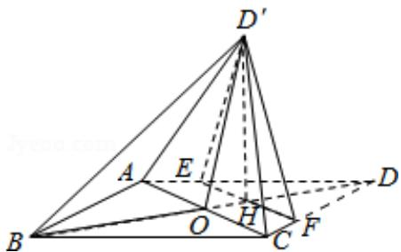

<!-- question-source:start -->
19. (12 分) 如图, 菱形 ABCD 的对角线 AC 与 BD 交于点 O, AB=5, AC=6, 点 E, F 分别在 AD, CD 上, AE=CF= $\frac{5}{4}$ , EF 交于 BD 于点 H, 将 $\triangle DEF$ 沿 EF 折到 $\triangle D'EF$ 的位置, $OD'=\sqrt{10}$ .

（Ⅰ）证明：D'H⊥平面 ABCD；

（II）求二面角 B - D'A - C 的正弦值.

<!-- question-source:end -->

![[高中/真题/按年份分类/2016/2016年全国统一高考数学试卷_理科__新课标ⅱ__含解析版_/解答题/题目/answers/Q00027281A1.md]]
