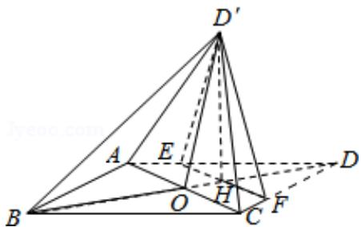

<!-- question-source:start -->
19.（12分）如图，菱形ABCD的对角线AC与BD交于点O, AB=5, AC=6, 点E, F分

别在 AD, CD 上, $AE=CF=\frac{5}{4}$ , EF 交于 BD 于点 H, 将 $\triangle DEF$ 沿 EF 折到 $\triangle D'EF$ 的位

置， $OD'=\sqrt{10}$ .

(Ⅰ) 证明: D'H⊥平面 ABCD;

（Ⅱ）求二面角 B - D'A - C 的正弦值.

【考点】MJ：二面角的平面角及求法.

【专题】15：综合题；35：转化思想；44：数形结合法；5G：空间角.

【
<!-- question-source:end -->

![[高中/真题/按年份分类/2016/2016年全国统一高考数学试卷_理科__新课标ⅱ__含解析版_/解答题/题目/answers/Q00028501A1.md]]
