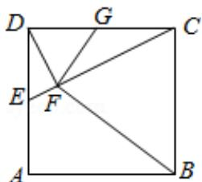

<!-- question-source:start -->
22. (10 分) 如图, 在正方形 ABCD 中, E, G 分别在边 DA, DC 上 (不与端点重合),

且 DE=DG，过 D 点作 $DF \perp CE$ ，垂足为 F.

（Ⅰ）证明：B，C，G，F四点共圆；

（II）若 AB=1，E 为 DA 的中点，求四边形 BCGF 的面积.

【考点】N8：圆内接多边形的性质与判定.

【专题】14：证明题.

【
<!-- question-source:end -->

![[高中/真题/按年份分类/2016/2016年全国统一高考数学试卷_理科__新课标ⅱ__含解析版_/解答题/题目/answers/Q00028504A1.md]]
