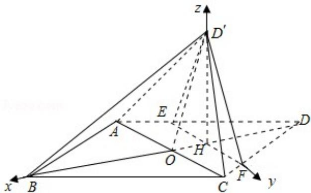

> [!faq]- 2016年全国统一高考数学试卷（理科）（新课标ⅱ）（含解析版）解析
>
> > [!success]- **【答案】** 详见解析
>
> > [!note]- **【分析】**
> > （Ⅰ）由底面 ABCD 为菱形，可得 AD=CD，结合 AE=CF 可得 EF∥AC，再由
>
> > [!note]- **【解析】**
> > （Ⅰ）证明：∵ABCD是菱形，
> >
> > $\therefore AD=DC$ ，又 $AE=CF=\frac{5}{4}$ ，
> >
> > $\therefore\frac{DE}{EA}=\frac{DF}{FC}$ ，则 $EF\|AC$ ，
> >
> > 又由 ABCD 是菱形，得 AC⊥BD，则 EF⊥BD，
> >
> > $\therefore EF\perp DH$ ，则 $EF\perp D'H$ ，
> >
> > ∵AC=6,
> >
> > $$
> > \therefore A O = 3,
> > $$
> >
> > 又 AB=5，AO⊥OB，
> >
> > $$
> > \therefore O B = 4,
> > $$
> >
> > $\therefore OH=\frac{AE}{AD}\cdot OD=1$ ，则 $DH=D'H=3$ ，
> >
> > $\therefore\left|OD^{\prime}\right|^{2}=\left|OH\right|^{2}+\left|D^{\prime}H\right|^{2}$ ，则 $D^{\prime}H\perp OH$ ，
> >
> > 又 $OH \cap EF = H,$
> >
> > $\therefore D'H \perp$ 平面 ABCD;
> >
> > （Ⅱ）解：以 H 为坐标原点，建立如图所示空间直角坐标系，
> >
> > ∵AB=5, AC=6,
> >
> > $\therefore B(5,0,0)$ , C(1,3,0), D'(0,0,3), A(1,-3,0),
> >
> > $\overrightarrow{AB} = (4, 3, 0), \overrightarrow{AD'} = (-1, 3, 3), \overrightarrow{AC} = (0, 6, 0)$ ,
> >
> > 设平面 ABD' 的一个法向量为 $\overrightarrow{n_{1}}=(x,y,z)$ ,
> >
> > 由 $\left\{\begin{aligned}\overrightarrow{n_{1}}&\cdot\overrightarrow{AB}=0\\\overrightarrow{n_{1}}&\cdot\overrightarrow{AD^{\prime}}=0\end{aligned}\right.$ ，得 $\left\{\begin{aligned}4x+3y=0\\-x+3y+3z=0\end{aligned}\right.$ ，取x=3，得y=-4，z=5.
> >
> > $$
> > \therefore \overrightarrow {n _ {1}} = (3, - 4, 5)
> > $$
> >
> > 同理可求得平面 AD'C 的一个法向量 $\overrightarrow{n_{2}}=(3,0,1)$ ,
> >
> > 设二面角二面角 B - D'A - C 的平面角为 $\theta$ ,
> >
> > 则 $|\cos \theta| = \frac{|\overrightarrow{n_1} \cdot \overrightarrow{n_2}|}{|\overrightarrow{n_1}| |\overrightarrow{n_2}|} = \frac{|3 \times 3 + 5 \times 1|}{5\sqrt{2} \times \sqrt{10}} = \frac{7\sqrt{5}}{25}$ .
> >
> > ∴二面角 B - D'A - C 的正弦值为 $\sin\theta=\frac{2\sqrt{95}}{25}$ .
> >
> > 
> >
> > 【点评】本题考查线面垂直的判定,考查了二面角的平面角的求法,训练了利用平
> >
> > 面的法向量求解二面角问题，体现了数学转化思想方法，是中档题.
