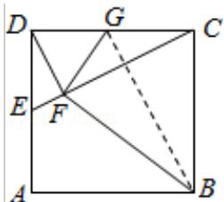

> [!faq]- 2016年全国统一高考数学试卷（理科）（新课标ⅱ）（含解析版）解析
>
> > [!success]- **【答案】** 详见解析
>
> > [!note]- **【分析】**
> > （Ⅰ）证明 B, C, G, F 四点共圆可证明四边形 BCGF 对角互补，由已知条件
>
> > [!note]- **【解析】**
> > （Ⅰ）证明：∵DF⊥CE，
> >
> > $$
> > \therefore \mathrm{Rt} \triangle \mathrm{DFC} \sim \mathrm{Rt} \triangle \mathrm{EDC},
> > $$
> >
> > $$
> > \therefore \frac {\mathrm{DF}}{\mathrm{ED}} = \frac {\mathrm{CF}}{\mathrm{CD}},
> > $$
> >
> > $$
> > \because D E = D G, \quad C D = B C,
> > $$
> >
> > $$
> > \therefore \frac {\mathrm{DF}}{\mathrm{DG}} = \frac {\mathrm{CF}}{\mathrm{BC}},
> > $$
> >
> > 又∵∠GDF=∠DEF=∠BCF,
> >
> > $$
> > \therefore \triangle G D F \sim \triangle B C F,
> > $$
> >
> > $\therefore \angle CFB = \angle DFG,$
> >
> > $$
> > \therefore \angle G F B = \angle G F C + \angle C F B = \angle G F C + \angle D F G = \angle D F C = 9 0 ^ {\circ},
> > $$
> >
> > $$
> > \therefore \angle G F B + \angle G C B = 1 8 0 ^ {\circ},
> > $$
> >
> > ∴B，C，G，F四点共圆.
> >
> > （II）∵E为AD中点，AB=1，∴DG=CG=DE= $\frac{1}{2}$ ，
> >
> > ∴在 Rt△DFC 中，GF= $\frac{1}{2}$ CD=GC，连接 GB，Rt△BCG≡Rt△BFG，
> >
> > $\therefore S_{\text{四边形}BCGF} = 2S_{\triangle BCG} = 2 \times \frac{1}{2} \times 1 \times \frac{1}{2} = \frac{1}{2}$ .
> >
> > 
> >
> > 【点评】本题考查四点共圆的判断,主要根据对角互补进行判断,注意三角形相似
> >
> > 和全等性质的应用.
> >
> > ## [选修 4-4：坐标系与参数方程]
