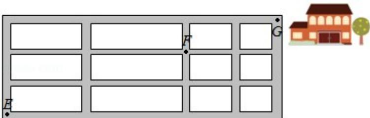

<!-- question-source:start -->
5.（5分）如图，小明从街道的E处出发，先到F处与小红会合，再一起到位于G处的老年公寓参加志愿者活动，则小明到老年公寓可以选择的最短路径条数为（）

A. 24 B. 18 C. 12 D. 9

【考点】D2：分步乘法计数原理；D9：排列、组合及简单计数问题.

【专题】12：应用题；34：方程思想；49：综合法；50：排列组合.

【
<!-- question-source:end -->

![[高中/真题/按年份分类/2016/2016年全国统一高考数学试卷_理科__新课标ⅱ__含解析版_/选择题/题目/answers/Q00027291A1.md]]
